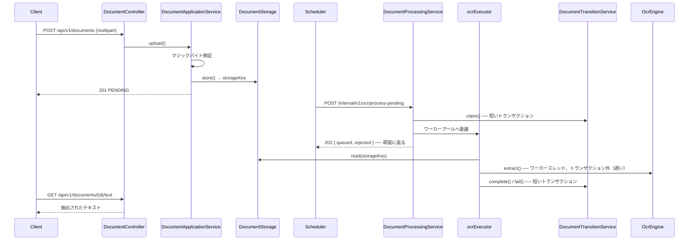

# OCR 自動化バックエンド

[English](README.md) | [한국어](README.ko.md) | [简体中文](README.zh-CN.md) | **日本語**

> ドキュメントを受け取り OCR でテキストを抽出して保管するサービス。
> **Spring Boot + Tesseract** の上にポート/アダプタ構造で組んだ。

OCR は遅く、よく失敗し、エンジンが入れ替わる。この三つを前提に置いて、
**遅い処理がリクエストを塞がないように**、**失敗してもドキュメントが失われないように**、
**エンジンを差し替えてもビジネスロジックがそのままであるように**することが目標だ。

「いつ処理するか」は [scheduler](https://github.com/hyunolike/ai.ocr-automation.system-backend.scheduler) が決め、
このサービスは**「どう処理するか」だけ**を知っている。

<br>

## 🎯 設計目標

- **OCR エンジンを差し替えられるようにする** — ビジネスロジックは `OcrEngine` ポートだけを知り、Tesseract はアダプタの一つに過ぎない
- **ストレージを差し替えられるようにする** — ローカル FS → S3 の移行がドメインに届かないよう `DocumentStorage` ポートで切る
- **遅い処理が DB コネクションも HTTP スレッドも掴まないようにする** — 受け付けと処理を分ける
- **状態遷移のルールはドメインが守る** — setter を開かず、意味のあるメソッドだけで状態を変える
- **他人のドキュメントが漏れないようにする** — 公開 API のすべての照会に所有者条件が付く

<br>

## 🚀 機能要件

### ドキュメントのアップロード

- 画像（PNG/JPEG/TIFF）または PDF を受け取り、保管して OCR 待ち行列に載せる。
- ファイル形式は**ヘッダーではなく内容（マジックバイト）で判断する。**
  拡張子と `Content-Type` はいくらでも変えられる。
- 同じ所有者が同じ内容（チェックサム一致）を再度アップロードした場合は、
  保存し直さず既存のドキュメントを返す。
  - ただし既存が `FAILED` なら再試行回数を初期化して再び待ち行列に載せる。
- 元のファイル名はストレージキーに入れない。パス操作とファイル名衝突をそもそも作らない。

### OCR 処理

- 待機中のドキュメントをバッチで**受け付け**、ワーカープールで処理する。
- 受け付けは処理を待たず即座に応答する。(`202 Accepted`)
- ワーカーキューが満杯なら、それ以上確保せず拒否数を返す。残りは次の周期で再び拾われる。
- 処理に失敗したら、再試行の余裕に応じて `PENDING` に戻すか `FAILED` に確定する。
- 処理途中でインスタンスが落ちて `PROCESSING` に止まったドキュメントは、一定時間後に回収する。

### 照会

- ドキュメントの状態と抽出結果の要約を照会する。
- 抽出された全文は**別エンドポイント**で受け取る。長くなり得るので詳細レスポンスには載せない。
- 一覧は状態で絞り込め、新しい順に並ぶ。

### 認証と所有者

- 公開 API は **API キー**を要求する。キーが所有者を決める。
- リクエストのどこにも所有者を指定する場所を置かない。
- 内部 API (`/internal`) は**共有トークン**を要求する。スケジューラ専用だ。
- ルールにない経路はすべて拒否する。

### 例外処理

- 以下のアップロードは拒否する。
  - 空ファイル、または許容サイズ超過
  - 許可リストにない形式
  - **ファイルの内容が宣言した形式と異なる場合**
  - 暗号化されている、またはページ数上限を超える PDF
- 他人のドキュメントを指定した場合は **403 ではなく 404** で応答する。
- 予期しない例外は `INTERNAL_ERROR` にまとめ、原因はサーバーログにだけ残す。

<br>

## 📄 インターフェース仕様

### 公開 API

すべての公開 API は API キーを要求する。

```
X-API-Key: ocrk_...
Authorization: Bearer ocrk_...   # どちらも受け付ける
```

| Method | Path | 説明 |
|---|---|---|
| `POST` | `/api/v1/documents` | アップロード（multipart、フィールド名 `file`）→ `201` |
| `GET` | `/api/v1/documents/{id}` | 状態・結果の要約 |
| `GET` | `/api/v1/documents?status=&page=&size=` | 一覧（状態フィルタ、新しい順） |
| `GET` | `/api/v1/documents/{id}/text` | 抽出された全文（`text/plain`） |

### 内部 API

スケジューラ専用。共有トークンを要求する。

```
X-Internal-Token: <トークン>
```

| Method | Path | 説明 |
|---|---|---|
| `POST` | `/internal/v1/ocr/process-pending?batchSize=20` | 待機ドキュメントをワーカープールに**受け付け** → `202` |
| `POST` | `/internal/v1/ocr/documents/{id}/process` | 1 件を**同期**処理（手動再処理） |
| `POST` | `/internal/v1/ocr/recover-stalled` | `PROCESSING` に滞留したドキュメントの回収 |
| `POST` | `/internal/v1/api-keys` | API キーの発行（平文はこのレスポンスにのみ現れる） |
| `GET` | `/internal/v1/api-keys?ownerId=` | キー一覧（平文もハッシュも含まない） |
| `DELETE` | `/internal/v1/api-keys/{prefix}` | キーの失効 |

> ⚠️ トークンは**二次防御**だ。一次はネットワークで、`/internal` はファイアウォールや
> イングレスで外部から届かないようにしなければならない。

### ドキュメントの状態

```
PENDING ──startProcessing──▶ PROCESSING ──completeWith──▶ COMPLETED
   ▲                              │
   │                              └──fail──▶ FAILED（再試行の上限を使い切った）
   └──────────────────────────────┘
        再試行の余裕が残っていれば PENDING に戻る
```

| 状態 | 意味 |
|---|---|
| `PENDING` | アップロード完了、OCR 待ち |
| `PROCESSING` | OCR 処理中 |
| `COMPLETED` | OCR 成功 |
| `FAILED` | 再試行の上限を使い切った |

### エラーコード

```json
{ "code": "CONTENT_MISMATCH", "message": "...", "timestamp": "2026-09-11T10:23:29Z" }
```

| code | HTTP | 状況 |
|---|---|---|
| `UNAUTHORIZED` | 401 | API キーの欠落・誤り・失効（内部 API はトークンの欠落・誤り） |
| `FORBIDDEN` | 403 | 認証は通ったがその経路の権限ではない |
| `CONTENT_MISMATCH` | 400 | 内容が宣言した形式と異なる、破損・暗号化された PDF、ページ数超過 |
| `INVALID_DOCUMENT` | 400 | 空ファイル、許可リスト外の形式、結果がまだない、処理待ち状態でない |
| `DOCUMENT_NOT_FOUND` | 404 | 存在しないドキュメント、**または他人のドキュメント** |
| `FILE_TOO_LARGE` | 413 | アップロードサイズ超過 |
| `STORAGE_ERROR` | 500 | ストレージ入出力の失敗 |
| `OCR_ENGINE_ERROR` | 503 | エンジンが使用不可 |
| `INTERNAL_ERROR` | 500 | その他の例外（原因はサーバーログにのみ） |

<br>

## 📐 プログラミング要件

- Java 21、Spring Boot 3.5.16、Spring Cloud Config Client を使う。
- DB は PostgreSQL（本番）/ H2（ローカル・テスト）、スキーマは **Flyway 単一の出所**で管理する。
  JPA は `validate` のみで、スキーマを作らない。
- **`OcrEngine` と `DocumentStorage` はポートだ。** ビジネスロジックはこのインターフェースだけを知り、
  具体実装（Tesseract、ローカル FS）はアダプタとして差し替える。
- **`DocumentApplicationService` は HTTP も OCR エンジンも知ってはならない。**
  REST を別のプロトコルに変えてもそのまま再利用できなければならない。
- **`DocumentProcessingService` に `@Transactional` を付けない。**
  遅い OCR が DB コネクションを掴まないよう、状態遷移は別の Bean に任せる。
  （同じクラス内で呼ぶとプロキシを経由せず、トランザクションが分離されない。）
- ドメインオブジェクトは setter を開かず、静的ファクトリと意味のあるメソッドで状態を変える。
  誤った状態遷移はサービスではなくドメインが防ぐ。
- **コントローラは所有者をパラメータで受け取らない。** `DocumentOwnerResolver` に尋ねる。
- **コミット単位は下の機能リスト単位とする。**

<br>

## ✅ 実装する機能リスト

- [x] ドメイン `Document` / `DocumentStatus` / `OcrResult`
  - [x] `Document.register()` 静的ファクトリ — 所有者なしでは登録できない
  - [x] `startProcessing()` / `completeWith()` / `fail()` の状態遷移
  - [x] `releaseClaim()` — キュー拒否時に再試行回数を上げずに返却
  - [x] `resetForRetry()` — 失敗ドキュメントの再アップロード時に再試行回数を初期化
  - [x] `isStalled()` / `recoverFromStall()` — 滞留判定と回収
  - [x] `@Version` 楽観ロック — 多重インスタンスでの重複確保を防ぐ
- [x] `DocumentRepository`
  - [x] 所有者範囲 / システム範囲の照会を名前とコメントで分離
- [x] `DocumentApplicationService` — 登録・照会
  - [x] サイズ・形式・内容の検証
  - [x] SHA-256 チェックサムによる重複判定（所有者範囲）
  - [x] 失敗ドキュメントの再アップロード時の再処理
- [x] OCR 処理パイプライン
  - [x] `DocumentProcessingService` — 確保 → ワーカープールへ委譲（トランザクションなし）
  - [x] `DocumentTransitionService` — 状態遷移専用（`REQUIRES_NEW`）
  - [x] 有界キュー + `AbortPolicy` バックプレッシャー
  - [x] どんな例外が出てもドキュメントを `PROCESSING` に残さない
- [x] `OcrEngine` ポート
  - [x] `TesseractOcrEngine` アダプタ
  - [x] `StubOcrEngine` — ネイティブのない環境用
  - [ ] Tesseract の単語単位の信頼度収集
  - [ ] 画像前処理（二値化・傾き補正）
  - [ ] PDF のページ単位処理
- [x] `DocumentStorage` ポート
  - [x] `LocalFileSystemDocumentStorage` — 日付ベースのキー、パス逸脱の遮断
  - [ ] S3 アダプタ
- [x] アップロード形式の検証
  - [x] マジックバイト（PNG / JPEG / TIFF / PDF）
  - [x] PDF の暗号化有無・ページ数上限
- [x] 認証・認可
  - [x] API キー — SHA-256 ハッシュで保存、発行時に平文を 1 回だけ表示
  - [x] `/internal` 共有トークン（定数時間比較）
  - [x] actuator を別ポートに分離
  - [x] ルールにない経路は `denyAll()`
  - [ ] HTTPS 終端
  - [ ] 運用者権限をサービス間トークンから分離
  - [ ] キーの有効期限・ローテーション、リクエスト制限
- [x] 所有者の分離
  - [x] すべての公開照会に所有者条件を強制
  - [x] 他人のドキュメントには 403 ではなく 404
  - [ ] 組織（tenant）単位への拡張
- [x] スキーマ (Flyway)
  - [x] `V1` documents / `V2` owner / `V3` api_keys
  - [ ] `NEEDS_REVIEW` 状態と信頼度ベースの品質ゲート
- [x] テスト
  - [x] ドメインの状態遷移
  - [x] ストレージアダプタ（パス逸脱の遮断を含む）
  - [x] 受け付けルール（キュー飽和時の確保解除）
  - [x] 形式検証（偽装ファイルの遮断）
  - [x] 認証（三つの経路）
  - [x] 所有者の分離
  - [x] パイプライン統合（アップロード → 受け付け → 非同期処理 → 照会）

<br>

## 📤 実行結果

> メッセージはサービスコードからそのまま出る韓国語だ。

### アップロード成功

**リクエスト**

```bash
curl -H "X-API-Key: ocrk_nRXV7l5..." -F "file=@scan.png" \
     http://localhost:8080/api/v1/documents
```

**レスポンス** `201 Created`

```json
{
  "id": "a1964f60-f20d-48b7-97e0-b68a45d91daa",
  "originalFilename": "scan.png",
  "contentType": "image/png",
  "sizeBytes": 24,
  "status": "PENDING",
  "retryCount": 0,
  "failureReason": null,
  "uploadedAt": "2026-09-11T10:23:29.681623Z",
  "finishedAt": null,
  "ocrResult": null
}
```

### 受け付け — 待たない

```bash
curl -X POST -H "X-Internal-Token: ..." \
     "http://localhost:8080/internal/v1/ocr/process-pending?batchSize=25"
```

**レスポンス** `202 Accepted` — 25 件の受け付けに **0.15 秒**

```json
{ "queued": 25, "rejected": 0, "skipped": 0 }
```

`queued` はキューに入れた数であって成功した数ではない。実際の結果はドキュメントの状態で確認する。

### 処理完了後の照会

```json
{
  "id": "a1964f60-7d14-4968-aa31-04ff7f105678",
  "status": "COMPLETED",
  "retryCount": 0,
  "finishedAt": "2026-09-11T07:13:41.479691Z",
  "ocrResult": {
    "engine": "stub",
    "language": "stub",
    "confidence": null,
    "pageCount": 1,
    "textLength": 85,
    "durationMillis": 1,
    "processedAt": "2026-09-11T07:13:41.476733Z"
  }
}
```

### 認証失敗 — キーがない

```json
{ "code": "UNAUTHORIZED", "message": "유효한 인증 정보가 필요합니다", "timestamp": "..." }
```

### 形式を偽装したアップロード

シェルスクリプトを `.png` に変え `Content-Type: image/png` で送った場合。

```json
{ "code": "CONTENT_MISMATCH", "message": "파일 내용이 image/png 형식이 아닙니다", "timestamp": "..." }
```

JPEG を PNG に偽装した場合 — **実際の形式まで知らせる。**

```json
{ "code": "CONTENT_MISMATCH", "message": "파일 내용이 image/png 형식이 아닙니다 (실제: image/jpeg)", "timestamp": "..." }
```

`%PDF-` で始まるが内容が壊れている場合。

```json
{ "code": "CONTENT_MISMATCH", "message": "PDF 를 읽을 수 없습니다: 손상되었거나 암호화된 파일입니다", "timestamp": "..." }
```

### 他人のドキュメントの照会 — 404

```json
{ "code": "DOCUMENT_NOT_FOUND", "message": "문서를 찾을 수 없습니다: e04fb648-...", "timestamp": "..." }
```

存在しないドキュメントを照会したときと応答が区別できない。403 は「そのドキュメントが存在する」
という事実を知らせることになり、それ自体が情報漏れだ。

<br>

## 🏗 アーキテクチャ



```
com.ocr.automation.backend
├── document/
│   ├── domain/          Document(状態マシン), DocumentStatus, OcrResult
│   ├── repository/      所有者範囲 / システム範囲に分離
│   ├── service/
│   │   ├── DocumentApplicationService    # 登録・照会（HTTP/OCR を知らない）
│   │   ├── DocumentProcessingService     # 受け付けオーケストレータ（トランザクションなし）
│   │   └── DocumentTransitionService     # 状態遷移専用（短いトランザクション）
│   ├── validation/      マジックバイト + PDF 検査
│   └── web/             Controller + DTO + ExceptionHandler（アダプタ）
├── ocr/
│   ├── OcrEngine.java                    # ポート
│   ├── tesseract/TesseractOcrEngine      # アダプタ
│   └── stub/StubOcrEngine                # ネイティブのない環境用
├── storage/
│   ├── DocumentStorage.java              # ポート
│   └── local/LocalFileSystemDocumentStorage
├── owner/DocumentOwnerResolver.java      # ポート
├── security/
│   ├── SecurityConfig.java               # 三つの認可レーン
│   ├── ApiKeyAuthenticationFilter        # 公開 API
│   ├── InternalTokenAuthenticationFilter # サービス間
│   └── apikey/                           # ApiKey ドメイン + 発行・検証
└── config/
```

### なぜサービスが三つなのか

| クラス | トランザクション | 役割 |
|---|---|---|
| `DocumentApplicationService` | あり | 登録・照会。短く単純 |
| `DocumentProcessingService` | **なし** | 確保 → ワーカープール委譲の順序だけを組む |
| `DocumentTransitionService` | `REQUIRES_NEW` | 状態遷移のみ。コネクションを長く掴まない |

OCR は数秒から数十秒かかる。一つのトランザクションの中で回すとコネクションプールがすぐ枯れる。
遷移メソッドを同じクラスに置くと**プロキシを経由せずトランザクションが分離されない**ため、
別の Bean に出した。

<br>

## 🛠 技術スタック

| 領域 | 技術 |
|---|---|
| 言語 | Java 21 |
| フレームワーク | Spring Boot 3.5.16 |
| 認証 | Spring Security（API キー / 共有トークン） |
| 設定 | Spring Cloud Config Client (2025.0.3) |
| 永続化 | Spring Data JPA、PostgreSQL(本番) / H2(ローカル・テスト) |
| マイグレーション | Flyway |
| OCR | Tesseract via tess4j 5.20.0 |
| PDF 検査 | Apache PDFBox |
| ビルド | Gradle 8.14.3 |

<br>

## 🏃 実行方法

**設定サーバーが先に起動していなければならない。** ポート・DB・ストレージの設定は
[ocr-config-server](https://github.com/hyunolike/ai.ocr-automation.system-config.server) から降ってくる。

```bash
# 1. 設定サーバー（別ターミナル、8888）
cd ../ai.ocr-automation.system-config.server && ./gradlew bootRun

# 2. バックエンド（local プロファイル = H2 + stub エンジン）
./gradlew bootRun
```

```bash
TOKEN=local-dev-only-token   # 開発既定値

# 3. API キーの発行
KEY=$(curl -sS -X POST http://localhost:8080/internal/v1/api-keys \
        -H "X-Internal-Token: $TOKEN" -H "Content-Type: application/json" \
        -d '{"ownerId":"demo","label":"ローカル"}' | jq -r .key)

# 4. アップロード
curl -H "X-API-Key: $KEY" -F "file=@scan.png" http://localhost:8080/api/v1/documents

# 5. 処理の受け付け（普段はスケジューラが呼ぶ）
curl -X POST -H "X-Internal-Token: $TOKEN" \
     http://localhost:8080/internal/v1/ocr/process-pending

# 6. 結果
curl -H "X-API-Key: $KEY" http://localhost:8080/api/v1/documents/{id}/text
```

| 項目 | アドレス |
|---|---|
| API | `http://localhost:8080/api/v1/documents` |
| H2 コンソール (local) | `http://localhost:8080/h2-console`（JDBC `jdbc:h2:mem:ocrdb`、user `sa`） |
| ヘルスチェック | `http://localhost:9080/actuator/health`（管理専用ポート） |

### テスト

```bash
./gradlew test
```

| テスト | 検証対象 |
|---|---|
| `DocumentTest` | 状態遷移ルール（再試行、滞留判定、誤った遷移の遮断） |
| `LocalFileSystemDocumentStorageTest` | キー生成、パス操作の遮断、ファイル名衝突 |
| `DocumentProcessingServiceTest` | 受け付けルール — キュー飽和時の確保解除、再試行回数を上げない |
| `ContentTypeVerificationTest` | 形式検証 — 偽装ファイルの遮断、破損・長すぎる PDF |
| `AuthenticationTest` | 三つの経路の認証 — キーの欠落・誤り・失効、権限の交差、未マッピング経路 |
| `DocumentOwnerIsolationTest` | 所有者の分離 — 他人のドキュメントの遮断、所有者別の重複判定 |
| `DocumentPipelineIntegrationTest` | アップロード → 受け付け → 非同期処理 → 照会の HTTP 往復 |

> テストは **Flyway でスキーマを作り JPA は `validate` のみ**を行う。
> エンティティとマイグレーションがずれると起動段階で壊れる。

<br>

## 🤔 設計で悩んだ点

| テーマ | 選択 | 理由 |
|---|---|---|
| 処理方式 | 同期処理ではなく受け付け + ワーカープール | `バッチサイズ × 1 件あたりの所要` が呼び出し側のタイムアウトを超える。リクエストが切れた後も処理は回り次の周期と重なる |
| バックプレッシャー | 有界キュー + `AbortPolicy` | `CallerRunsPolicy` は HTTP スレッドに OCR を代行させ、タイムアウト問題をそのまま蘇らせる |
| キュー拒否時 | `fail()` ではなく `releaseClaim()` | キューが混んだのはドキュメントのせいではない。失敗として数えると健全なドキュメントが `FAILED` に押し出される |
| 作業の消失 | インメモリキュー + 滞留回収 | 落ちると待機中の作業は消えるが、そのドキュメントは `PROCESSING` なので回収ジョブがすでに拾う |
| エンジン差し替え | ポート + `@ConditionalOnProperty` | stub エンジンのおかげでネイティブなしにパイプライン全体をテストできる |
| ストレージの戻り値 | パスではなく**ストレージキー** | S3 に移すときドメインとサービスが変わらない |
| 形式検証 | Tika ではなくマジックバイトを自前実装 | 許可形式は四つだけなのに、Tika は数百形式のために依存と起動時間を持ち込む |
| PDF 検査の時点 | アップロード時 | 通すと OCR 段階で初めて露見する。そのときはワーカーと再試行の上限をすでに浪費した後だ |
| API キーのハッシュ | bcrypt ではなく SHA-256 | 遅いハッシュは低エントロピーのパスワード用だ。256 ビット乱数には不要で、リクエストごとの検証では遅延だけが増える |
| トークン比較 | `MessageDigest.isEqual` | `String.equals` は最初の不一致で止まり、応答時間から 1 文字ずつ割り出せる |
| 認可の既定 | `anyRequest().denyAll()` | ルールを書き漏らすと開くのではなく塞がる。誤って開くよりよい |
| 他人のドキュメント | 403 ではなく 404 | 403 はそのドキュメントが存在する事実を知らせる |
| 重複判定 | グローバルではなく所有者範囲 | グローバルだと同じファイルを上げた他人のドキュメント ID が返ってくる |
| スキーマの出所 | Flyway 一つ、JPA は `validate` | ローカルも PostgreSQL モードの H2 で同じマイグレーションを回すので、ずれが本番前に露見する |

<br>

## ⚠️ 既知の簡略化

初期構造の段階で意図的に残した部分だ。実運用の前に必ず解消しなければならない。

- **HTTPS がない** — API キーと内部トークンが平文で流れる。信頼できない区間を通るなら TLS 終端が必須だ。
- **キー発行の権限がサービス間トークンと同じ** — スケジューラが使うトークンでキーも発行できる。運用者権限を別に設けねばならない。
- **`/internal` が公開ポートに開いている** — トークンで守られてはいるが経路自体は 8080 に露出する。ファイアウォール・イングレスでの遮断が一次防御だ。
- **キーの有効期限がない** — 失効は手動で、期限もない。ローテーションポリシーが要る。
- **リクエスト制限がない** — キー一つで無制限に呼べる。
- **ファイル全体をメモリに載せる** — 20MB 制限で持ちこたえているが、大きなファイルを扱うにはストリーミングが要る。
- **Tesseract の信頼度を収集しない** — `confidence` が常に `null` で、品質ゲートを作れない。
- **PDF のページ数を結果に数えない** — 検証時には数えるが結果の `pageCount` は `null` だ。
- **滞留回収が時間基準のみ** — 処理に時間のかかる正常なドキュメントも回収され得る。heartbeat 更新があって初めて正確になる。
- **元のドキュメントを削除しない** — 処理が終わってもファイルは溜まり続ける。保管期間ポリシーが要る。
- **ローカルファイルシステムはスケールアウトできない** — インスタンスを増やすと他のインスタンスが保存したファイルを読めない。

<br>

## 🗺 今後実装するもの

- [ ] HTTPS 終端、運用者権限の分離、キーの有効期限・ローテーション、リクエスト制限
- [ ] コンテナイメージ（tesseract はこのサービスのイメージにだけ）+ CI
- [ ] 可観測性 — 待機ドキュメント数、処理時間、キュー飽和、回収件数
- [ ] 画像前処理（解像度正規化・二値化・傾き補正）
- [ ] Tesseract の単語単位の信頼度収集 + `NEEDS_REVIEW` 状態
- [ ] PDF のページ単位処理（テキストレイヤーがあれば OCR を省略）
- [ ] S3 ストレージアダプタ（ポートはそのまま）
- [ ] ドキュメント保管期間ポリシーと整理バッチ
- [ ] 抽出テキストから構造化フィールドを取り出す
