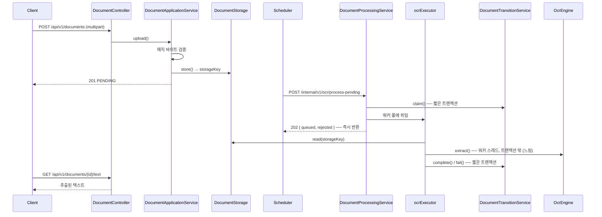

# OCR 자동화 백엔드

[English](README.md) | **한국어** | [简体中文](README.zh-CN.md) | [日本語](README.ja.md)

> 문서를 받아 OCR로 텍스트를 추출하고 보관하는 서비스.
> **Spring Boot + Tesseract** 위에서 포트/어댑터 구조로 구성했다.

OCR은 느리고, 자주 실패하고, 엔진이 바뀐다. 이 세 가지를 전제로 두고
**느린 작업이 요청을 붙잡지 않게**, **실패해도 문서가 유실되지 않게**,
**엔진을 갈아끼워도 비즈니스 로직이 그대로이게** 만드는 것이 목표다.

"언제 처리할지"는 [scheduler](https://github.com/hyunolike/ai.ocr-automation.system-backend.scheduler)가 정하고,
이 서비스는 **"어떻게 처리할지"만** 안다.

<br>

## 🎯 설계 목표

- **OCR 엔진을 갈아끼울 수 있게 한다** — 비즈니스 로직은 `OcrEngine` 포트만 알고, Tesseract는 어댑터 하나일 뿐이다
- **스토리지를 갈아끼울 수 있게 한다** — 로컬 FS → S3 전환이 도메인에 닿지 않게 `DocumentStorage` 포트로 끊는다
- **느린 작업이 DB 커넥션도 HTTP 스레드도 잡지 않게 한다** — 접수와 처리를 분리한다
- **상태 전이 규칙은 도메인이 지킨다** — setter 없이 의미 있는 메서드로만 상태를 바꾼다
- **남의 문서가 새어나가지 않게 한다** — 공개 API의 모든 조회에 소유자 조건이 붙는다

<br>

## 🚀 기능 요구사항

### 문서 업로드

- 이미지(PNG/JPEG/TIFF) 또는 PDF를 받아 보관하고 OCR 대기열에 올린다.
- 파일 형식은 **헤더가 아니라 내용(매직 바이트)으로 판단한다.**
  확장자와 `Content-Type`은 얼마든지 바꿀 수 있다.
- 같은 소유자가 같은 내용(체크섬 일치)을 다시 올리면 새로 저장하지 않고 기존 문서를 돌려준다.
  - 단, 기존 문서가 `FAILED`라면 재시도 횟수를 초기화하고 다시 대기열에 올린다.
- 원본 파일명은 스토리지 키에 넣지 않는다. 경로 조작과 파일명 충돌을 애초에 만들지 않는다.

### OCR 처리

- 대기 중인 문서를 배치로 **접수**하고 워커 풀에서 처리한다.
- 접수는 처리를 기다리지 않고 즉시 응답한다. (`202 Accepted`)
- 워커 큐가 가득 차면 더 선점하지 않고 거부 수를 돌려준다. 남은 문서는 다음 주기에 다시 집힌다.
- 처리에 실패하면 재시도 여유에 따라 `PENDING`으로 되돌리거나 `FAILED`로 확정한다.
- 처리 도중 인스턴스가 죽어 `PROCESSING`에 멈춘 문서는 일정 시간 뒤 회수한다.

### 조회

- 문서 상태와 추출 결과 요약을 조회한다.
- 추출된 전체 텍스트는 **별도 엔드포인트**로 받는다. 길어질 수 있어 상세 응답에 싣지 않는다.
- 목록은 상태로 거를 수 있고, 최신순으로 정렬한다.

### 인증과 소유자

- 공개 API는 **API 키**를 요구한다. 키가 소유자를 결정한다.
- 요청 어디에도 소유자를 지정하는 자리를 두지 않는다.
- 내부 API(`/internal`)는 **공유 토큰**을 요구한다. 스케줄러 전용이다.
- 규칙에 없는 경로는 모두 거절한다.

### 예외 처리

- 아래 업로드 요청은 거부한다.
  - 빈 파일이거나 허용 크기를 넘는 경우
  - 허용 목록에 없는 형식인 경우
  - **파일 내용이 선언한 형식과 다른 경우**
  - 암호화됐거나 페이지 수 상한을 넘는 PDF인 경우
- 남의 문서를 지목한 경우 **403이 아니라 404**로 응답한다.
- 예상하지 못한 예외는 `INTERNAL_ERROR`로 묶고, 원인은 서버 로그에만 남긴다.

<br>

## 📄 인터페이스 규격

### 공개 API

모든 공개 API는 API 키를 요구한다.

```
X-API-Key: ocrk_...
Authorization: Bearer ocrk_...   # 둘 다 받는다
```

| Method | Path | 설명 |
|---|---|---|
| `POST` | `/api/v1/documents` | 문서 업로드 (multipart, 필드명 `file`) → `201` |
| `GET` | `/api/v1/documents/{id}` | 문서 상태·결과 요약 |
| `GET` | `/api/v1/documents?status=&page=&size=` | 목록 (상태 필터, 최신순) |
| `GET` | `/api/v1/documents/{id}/text` | 추출된 전체 텍스트 (`text/plain`) |

### 내부 API

스케줄러 전용. 공유 토큰을 요구한다.

```
X-Internal-Token: <토큰>
```

| Method | Path | 설명 |
|---|---|---|
| `POST` | `/internal/v1/ocr/process-pending?batchSize=20` | 대기 문서를 워커 풀에 **접수** → `202` |
| `POST` | `/internal/v1/ocr/documents/{id}/process` | 한 건 **동기** 처리 (수동 재처리) |
| `POST` | `/internal/v1/ocr/recover-stalled` | 정체된 `PROCESSING` 문서 회수 |
| `POST` | `/internal/v1/api-keys` | API 키 발급 (평문은 이 응답에서만) |
| `GET` | `/internal/v1/api-keys?ownerId=` | 키 목록 (평문·해시 미포함) |
| `DELETE` | `/internal/v1/api-keys/{prefix}` | 키 폐기 |

> ⚠️ 토큰은 **2차 방어**다. 1차는 네트워크다 — `/internal`은 방화벽이나 인그레스에서
> 외부에 닿지 않게 막아야 한다.

### 문서 상태

```
PENDING ──startProcessing──▶ PROCESSING ──completeWith──▶ COMPLETED
   ▲                              │
   │                              └──fail──▶ FAILED (재시도 한도 소진)
   └──────────────────────────────┘
        재시도 여유가 남아 있으면 PENDING으로 되돌아간다
```

| 상태 | 의미 |
|---|---|
| `PENDING` | 업로드 완료, OCR 대기 |
| `PROCESSING` | OCR 처리 중 |
| `COMPLETED` | OCR 성공 |
| `FAILED` | 재시도 한도 소진 |

### 오류 코드

```json
{ "code": "CONTENT_MISMATCH", "message": "...", "timestamp": "2026-09-11T10:23:29Z" }
```

| code | HTTP | 상황 |
|---|---|---|
| `UNAUTHORIZED` | 401 | API 키 누락·오류·폐기됨 (내부 API는 토큰 누락·오류) |
| `FORBIDDEN` | 403 | 인증은 됐으나 그 경로의 권한이 아님 |
| `CONTENT_MISMATCH` | 400 | 내용이 선언한 형식과 다름, 손상·암호화된 PDF, 페이지 수 초과 |
| `INVALID_DOCUMENT` | 400 | 빈 파일, 허용 목록 밖 형식, 결과가 아직 없음, 처리 대기 상태가 아님 |
| `DOCUMENT_NOT_FOUND` | 404 | 없는 문서, **또는 남의 문서** |
| `FILE_TOO_LARGE` | 413 | 업로드 크기 초과 |
| `STORAGE_ERROR` | 500 | 스토리지 입출력 실패 |
| `OCR_ENGINE_ERROR` | 503 | 엔진 사용 불가 |
| `INTERNAL_ERROR` | 500 | 그 밖의 예외 (원인은 서버 로그에만) |

<br>

## 📐 프로그래밍 요구사항

- Java 21, Spring Boot 3.5.16, Spring Cloud Config Client를 사용한다.
- DB는 PostgreSQL(운영) / H2(로컬·테스트), 스키마는 **Flyway 단일 출처**로 관리한다.
  JPA는 `validate`만 하고 스키마를 만들지 않는다.
- **`OcrEngine`과 `DocumentStorage`는 포트다.** 비즈니스 로직은 이 인터페이스만 알고,
  구체 구현(Tesseract, 로컬 FS)은 어댑터로 갈아끼운다.
- **`DocumentApplicationService`는 HTTP도 OCR 엔진도 몰라야 한다.**
  REST를 다른 프로토콜로 바꿔도 그대로 재사용 가능해야 한다.
- **`DocumentProcessingService`에는 `@Transactional`을 두지 않는다.**
  느린 OCR이 DB 커넥션을 잡지 않도록 상태 전이는 별도 빈에 맡긴다.
  (같은 클래스 안에서 호출하면 프록시를 타지 않아 트랜잭션이 분리되지 않는다.)
- 도메인 객체는 setter를 열지 않고, 정적 팩토리와 의미 있는 메서드로 상태를 바꾼다.
  잘못된 상태 전이는 서비스가 아니라 도메인이 막는다.
- **컨트롤러는 소유자를 파라미터로 받지 않는다.** `DocumentOwnerResolver`에 묻는다.
- **커밋 단위는 아래 기능 목록 단위로 한다.**

<br>

## ✅ 구현할 기능 목록

- [x] 도메인 `Document` / `DocumentStatus` / `OcrResult`
  - [x] `Document.register()` 정적 팩토리 — 소유자 없이는 등록 불가
  - [x] `startProcessing()` / `completeWith()` / `fail()` 상태 전이
  - [x] `releaseClaim()` — 큐 거부 시 재시도 횟수를 올리지 않고 반납
  - [x] `resetForRetry()` — 실패 문서 재업로드 시 재시도 횟수 초기화
  - [x] `isStalled()` / `recoverFromStall()` — 정체 판정과 회수
  - [x] `@Version` 낙관적 락 — 다중 인스턴스 중복 선점 방지
- [x] `DocumentRepository`
  - [x] 소유자 범위 / 시스템 범위 조회를 이름과 주석으로 분리
- [x] `DocumentApplicationService` — 등록·조회
  - [x] 크기·형식·내용 검증
  - [x] SHA-256 체크섬 기반 중복 판정 (소유자 범위)
  - [x] 실패 문서 재업로드 시 재처리
- [x] OCR 처리 파이프라인
  - [x] `DocumentProcessingService` — 선점 → 워커 풀 위임 (트랜잭션 없음)
  - [x] `DocumentTransitionService` — 상태 전이 전용 (`REQUIRES_NEW`)
  - [x] 바운드 큐 + `AbortPolicy` 백프레셔
  - [x] 어떤 예외가 나도 문서를 `PROCESSING`에 남기지 않는다
- [x] `OcrEngine` 포트
  - [x] `TesseractOcrEngine` 어댑터
  - [x] `StubOcrEngine` — 네이티브 없는 환경용
  - [ ] Tesseract 단어 단위 신뢰도 수집
  - [ ] 이미지 전처리 (이진화·기울기 보정)
  - [ ] PDF 페이지 단위 처리
- [x] `DocumentStorage` 포트
  - [x] `LocalFileSystemDocumentStorage` — 날짜 기반 키, 경로 이탈 차단
  - [ ] S3 어댑터
- [x] 업로드 형식 검증
  - [x] 매직 바이트 (PNG / JPEG / TIFF / PDF)
  - [x] PDF 암호화 여부·페이지 수 상한
- [x] 인증·인가
  - [x] API 키 — SHA-256 해시 저장, 발급 시 평문 1회 노출
  - [x] `/internal` 공유 토큰 (상수 시간 비교)
  - [x] actuator 별도 포트 분리
  - [x] 규칙에 없는 경로는 `denyAll()`
  - [ ] HTTPS 종단
  - [ ] 운영자 권한을 서비스 간 토큰에서 분리
  - [ ] 키 유효기간·회전, 요청 한도
- [x] 소유자 격리
  - [x] 모든 공개 조회에 소유자 조건 강제
  - [x] 남의 문서에 403이 아니라 404
  - [ ] 조직(tenant) 단위 확장
- [x] 스키마 (Flyway)
  - [x] `V1` documents / `V2` owner / `V3` api_keys
  - [ ] `NEEDS_REVIEW` 상태와 신뢰도 기반 품질 게이트
- [x] 테스트
  - [x] 도메인 상태 전이
  - [x] 스토리지 어댑터 (경로 이탈 차단 포함)
  - [x] 접수 규칙 (큐 포화 시 선점 해제)
  - [x] 형식 검증 (위장 파일 차단)
  - [x] 인증 (세 갈래)
  - [x] 소유자 격리
  - [x] 파이프라인 통합 (업로드 → 접수 → 비동기 처리 → 조회)

<br>

## 📤 실행 결과

### 업로드 성공

**요청**

```bash
curl -H "X-API-Key: ocrk_nRXV7l5..." -F "file=@scan.png" \
     http://localhost:8080/api/v1/documents
```

**응답** `201 Created`

```json
{
  "id": "a1964f60-f20d-48b7-97e0-b68a45d91daa",
  "originalFilename": "scan.png",
  "contentType": "image/png",
  "sizeBytes": 24,
  "status": "PENDING",
  "retryCount": 0,
  "failureReason": null,
  "uploadedAt": "2026-09-11T10:23:29.681623Z",
  "finishedAt": null,
  "ocrResult": null
}
```

### 처리 접수 — 기다리지 않는다

```bash
curl -X POST -H "X-Internal-Token: ..." \
     "http://localhost:8080/internal/v1/ocr/process-pending?batchSize=25"
```

**응답** `202 Accepted` — 25건 접수에 **0.15초**

```json
{ "queued": 25, "rejected": 0, "skipped": 0 }
```

`queued`는 큐에 넣은 수일 뿐 성공한 수가 아니다. 실제 결과는 문서 상태로 확인한다.

### 처리 완료 후 조회

```json
{
  "id": "a1964f60-7d14-4968-aa31-04ff7f105678",
  "status": "COMPLETED",
  "retryCount": 0,
  "finishedAt": "2026-09-11T07:13:41.479691Z",
  "ocrResult": {
    "engine": "stub",
    "language": "stub",
    "confidence": null,
    "pageCount": 1,
    "textLength": 85,
    "durationMillis": 1,
    "processedAt": "2026-09-11T07:13:41.476733Z"
  }
}
```

### 인증 실패 — 키가 없음

```json
{ "code": "UNAUTHORIZED", "message": "유효한 인증 정보가 필요합니다", "timestamp": "..." }
```

### 형식을 속인 업로드

셸 스크립트를 `.png`로 바꾸고 `Content-Type: image/png`로 보낸 경우.

```json
{ "code": "CONTENT_MISMATCH", "message": "파일 내용이 image/png 형식이 아닙니다", "timestamp": "..." }
```

JPEG를 PNG로 위장한 경우 — **실제 형식까지 알려준다.**

```json
{ "code": "CONTENT_MISMATCH", "message": "파일 내용이 image/png 형식이 아닙니다 (실제: image/jpeg)", "timestamp": "..." }
```

`%PDF-`로 시작하지만 내용이 깨진 경우.

```json
{ "code": "CONTENT_MISMATCH", "message": "PDF 를 읽을 수 없습니다: 손상되었거나 암호화된 파일입니다", "timestamp": "..." }
```

### 남의 문서 조회 — 404

```json
{ "code": "DOCUMENT_NOT_FOUND", "message": "문서를 찾을 수 없습니다: e04fb648-...", "timestamp": "..." }
```

없는 문서를 조회했을 때와 응답이 구분되지 않는다. 403은 "그 문서가 존재한다"는
사실을 알려주는 셈이라 그 자체로 정보가 샌다.

<br>

## 🏗 아키텍처



```
com.ocr.automation.backend
├── document/
│   ├── domain/          Document(상태 머신), DocumentStatus, OcrResult
│   ├── repository/      소유자 범위 / 시스템 범위로 분리
│   ├── service/
│   │   ├── DocumentApplicationService    # 등록·조회 (HTTP/OCR을 모름)
│   │   ├── DocumentProcessingService     # 접수 오케스트레이터 (트랜잭션 없음)
│   │   └── DocumentTransitionService     # 상태 전이 전용 (짧은 트랜잭션)
│   ├── validation/      매직 바이트 + PDF 검사
│   └── web/             Controller + DTO + ExceptionHandler (어댑터)
├── ocr/
│   ├── OcrEngine.java                    # 포트
│   ├── tesseract/TesseractOcrEngine      # 어댑터
│   └── stub/StubOcrEngine                # 네이티브 없는 환경용
├── storage/
│   ├── DocumentStorage.java              # 포트
│   └── local/LocalFileSystemDocumentStorage
├── owner/DocumentOwnerResolver.java      # 포트
├── security/
│   ├── SecurityConfig.java               # 세 갈래 인가 규칙
│   ├── ApiKeyAuthenticationFilter        # 공개 API
│   ├── InternalTokenAuthenticationFilter # 서비스 간
│   └── apikey/                           # ApiKey 도메인 + 발급·검증
└── config/
```

### 왜 서비스가 셋인가

| 클래스 | 트랜잭션 | 역할 |
|---|---|---|
| `DocumentApplicationService` | 있음 | 등록·조회. 짧고 단순 |
| `DocumentProcessingService` | **없음** | 선점 → 워커 풀 위임 순서만 잡는다 |
| `DocumentTransitionService` | `REQUIRES_NEW` | 상태 전이만. 커넥션을 오래 잡지 않는다 |

OCR은 수 초에서 수십 초가 걸린다. 한 트랜잭션 안에서 돌리면 커넥션 풀이 금방 마른다.
전이 메서드를 같은 클래스에 두면 **프록시를 타지 않아 트랜잭션이 분리되지 않으므로**
별도 빈으로 뺐다.

<br>

## 🛠 기술 스택

| 영역 | 기술 |
|---|---|
| 언어 | Java 21 |
| 프레임워크 | Spring Boot 3.5.16 |
| 인증 | Spring Security (API 키 / 공유 토큰) |
| 설정 | Spring Cloud Config Client (2025.0.3) |
| 영속성 | Spring Data JPA, PostgreSQL(운영) / H2(로컬·테스트) |
| 마이그레이션 | Flyway |
| OCR | Tesseract via tess4j 5.20.0 |
| PDF 검사 | Apache PDFBox |
| 빌드 | Gradle 8.14.3 |

<br>

## 🏃 실행 방법

**설정 서버가 먼저 떠 있어야 한다.** 포트·DB·스토리지 설정을
[ocr-config-server](https://github.com/hyunolike/ai.ocr-automation.system-config.server)에서 내려받는다.

```bash
# 1. 설정 서버 (별도 터미널, 8888)
cd ../ai.ocr-automation.system-config.server && ./gradlew bootRun

# 2. 백엔드 (local 프로파일 = H2 + stub 엔진)
./gradlew bootRun
```

```bash
TOKEN=local-dev-only-token   # 개발 기본값

# 3. API 키 발급
KEY=$(curl -sS -X POST http://localhost:8080/internal/v1/api-keys \
        -H "X-Internal-Token: $TOKEN" -H "Content-Type: application/json" \
        -d '{"ownerId":"demo","label":"로컬"}' | jq -r .key)

# 4. 업로드
curl -H "X-API-Key: $KEY" -F "file=@scan.png" http://localhost:8080/api/v1/documents

# 5. 처리 접수 (평소엔 스케줄러가 호출한다)
curl -X POST -H "X-Internal-Token: $TOKEN" \
     http://localhost:8080/internal/v1/ocr/process-pending

# 6. 결과
curl -H "X-API-Key: $KEY" http://localhost:8080/api/v1/documents/{id}/text
```

| 항목 | 주소 |
|---|---|
| API | `http://localhost:8080/api/v1/documents` |
| H2 콘솔 (local) | `http://localhost:8080/h2-console` (JDBC `jdbc:h2:mem:ocrdb`, user `sa`) |
| 헬스체크 | `http://localhost:9080/actuator/health` (관리 전용 포트) |

### 테스트

```bash
./gradlew test
```

| 테스트 | 검증 대상 |
|---|---|
| `DocumentTest` | 상태 전이 규칙 (재시도, 정체 판정, 잘못된 전이 차단) |
| `LocalFileSystemDocumentStorageTest` | 키 생성, 경로 조작 차단, 파일명 충돌 |
| `DocumentProcessingServiceTest` | 접수 규칙 — 큐 포화 시 선점 해제, 재시도 횟수 미증가 |
| `ContentTypeVerificationTest` | 형식 검증 — 위장 파일 차단, 손상·과길이 PDF |
| `AuthenticationTest` | 세 갈래 인증 — 키 누락·오류·폐기, 권한 교차, 미매핑 경로 |
| `DocumentOwnerIsolationTest` | 소유자 격리 — 남의 문서 차단, 소유자별 중복 판정 |
| `DocumentPipelineIntegrationTest` | 업로드 → 접수 → 비동기 처리 → 조회 HTTP 왕복 |

> 테스트는 **Flyway로 스키마를 만들고 JPA는 `validate`만** 한다.
> 엔티티와 마이그레이션이 어긋나면 기동 단계에서 깨진다.

<br>

## 🤔 설계하며 고민한 점

| 주제 | 선택 | 이유 |
|---|---|---|
| 처리 방식 | 동기 처리 대신 접수 + 워커 풀 | `배치 크기 × 건당 소요`가 호출자 타임아웃을 넘긴다. 요청이 끊긴 뒤에도 처리는 돌아 다음 주기와 겹친다 |
| 백프레셔 | 바운드 큐 + `AbortPolicy` | `CallerRunsPolicy`는 HTTP 스레드가 OCR을 대신 돌게 해 타임아웃 문제를 되살린다 |
| 큐 거부 시 | `fail()`이 아니라 `releaseClaim()` | 큐가 붐빈 것은 문서의 잘못이 아니다. 실패로 세면 멀쩡한 문서가 `FAILED`로 밀려난다 |
| 작업 유실 | 인메모리 큐 + 정체 회수 | 죽으면 대기 작업이 사라지지만, 그 문서는 `PROCESSING`이라 회수 잡이 이미 걷어간다 |
| 엔진 교체 | 포트 + `@ConditionalOnProperty` | stub 엔진 덕에 네이티브 없이 파이프라인 전체를 테스트할 수 있다 |
| 스토리지 반환값 | 경로가 아닌 **스토리지 키** | S3로 옮길 때 도메인과 서비스가 바뀌지 않는다 |
| 형식 검증 | Tika 대신 매직 바이트 직접 구현 | 허용 형식이 넷뿐인데 Tika는 수백 형식을 위해 의존성과 기동 시간을 가져온다 |
| PDF 검사 시점 | 업로드 시점 | 통과시키면 OCR 단계에서야 드러난다. 그때는 워커와 재시도 한도를 이미 낭비한 뒤다 |
| API 키 해시 | bcrypt 대신 SHA-256 | 느린 해시는 저엔트로피 비밀번호용이다. 256비트 난수에는 불필요하고, 요청마다 도는 검증에 지연만 더한다 |
| 토큰 비교 | `MessageDigest.isEqual` | `String.equals`는 첫 불일치에서 멈춰 응답 시간으로 한 글자씩 알아낼 수 있다 |
| 인가 기본값 | `anyRequest().denyAll()` | 규칙을 빠뜨리면 열리는 것이 아니라 막힌다. 실수로 열리는 쪽보다 낫다 |
| 남의 문서 | 403이 아니라 404 | 403은 그 문서가 존재한다는 사실을 알려준다 |
| 중복 판정 | 전역이 아닌 소유자 범위 | 전역이면 같은 파일을 올린 남의 문서 ID를 돌려받는다 |
| 스키마 출처 | Flyway 하나, JPA는 `validate` | 로컬도 H2를 PostgreSQL 모드로 띄워 같은 마이그레이션을 돌린다. 불일치가 운영 전에 드러난다 |

<br>

## ⚠️ 알려진 단순화

초기 구조 단계로 의도적으로 남겨둔 부분이다. 실전 적용 전에 반드시 해소해야 한다.

- **HTTPS가 없다** — API 키와 내부 토큰이 평문으로 오간다. 신뢰할 수 없는 구간을 지난다면 TLS 종단이 필수다.
- **키 발급 권한이 서비스 간 토큰과 같다** — 스케줄러가 쓰는 토큰으로 키도 발급할 수 있다. 운영자 권한을 따로 두어야 한다.
- **`/internal`이 공개 포트에 열려 있다** — 토큰으로 막혀 있지만 경로 자체는 8080에 노출된다. 방화벽·인그레스 차단이 1차 방어다.
- **키 만료가 없다** — 폐기는 수동이며 유효기간이 없다. 회전 정책이 필요하다.
- **요청 한도가 없다** — 키 하나로 무제한 호출할 수 있다.
- **파일 전체를 메모리에 올린다** — 20MB 제한으로 버티지만, 큰 파일을 다루려면 스트리밍이 필요하다.
- **Tesseract 신뢰도를 수집하지 않는다** — `confidence`가 항상 `null`이다. 품질 게이트를 만들 수 없다.
- **PDF 페이지 수를 세지 않는다** — 검증 때는 세지만 결과의 `pageCount`는 `null`이다.
- **정체 회수가 시간 기준뿐이다** — 처리가 오래 걸리는 정상 문서도 회수될 수 있다. heartbeat 갱신이 있어야 정확하다.
- **원본 문서를 지우지 않는다** — 처리가 끝나도 파일이 계속 쌓인다. 보관 기간 정책이 필요하다.
- **로컬 파일시스템은 스케일아웃이 안 된다** — 인스턴스를 늘리면 다른 인스턴스가 저장한 파일을 읽지 못한다.

<br>

## 🗺 앞으로 구현할 것

- [ ] HTTPS 종단, 운영자 권한 분리, 키 유효기간·회전, 요청 한도
- [ ] 컨테이너 이미지 (tesseract는 이 서비스 이미지에만) + CI
- [ ] 관측성 — 대기 문서 수, 처리 시간, 큐 포화, 회수 건수
- [ ] 이미지 전처리 (해상도 정규화·이진화·기울기 보정)
- [ ] Tesseract 단어 단위 신뢰도 수집 + `NEEDS_REVIEW` 상태
- [ ] PDF 페이지 단위 처리 (텍스트 레이어가 있으면 OCR 생략)
- [ ] S3 스토리지 어댑터 (포트는 그대로)
- [ ] 문서 보관 기간 정책과 정리 배치
- [ ] 추출 텍스트에서 구조화 필드 뽑기
