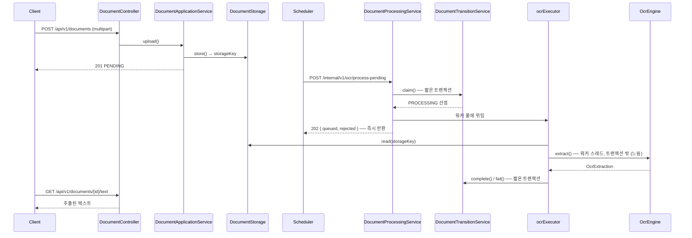

# ai.ocr-automation.system-backend

OCR 자동화 시스템의 **백엔드**. 문서 업로드/조회 API 와 OCR 처리 파이프라인을 담당한다.

"언제 처리할지"는 [scheduler](https://github.com/hyunolike/ai.ocr-automation.system-backend.scheduler)가 정하고,
이 서비스는 **"어떻게 처리할지"만** 안다. OCR 엔진 의존성과 스토리지 접근을 한곳에 모아두기 위한 분담이다.

<br>

## 🎯 설계 목표

- **OCR 엔진을 갈아 끼울 수 있게 한다** — 비즈니스 로직은 `OcrEngine` 포트만 알고, Tesseract 는 어댑터 하나일 뿐이다
- **스토리지를 갈아 끼울 수 있게 한다** — 로컬 FS → S3 전환이 도메인에 닿지 않게 `DocumentStorage` 포트로 끊는다
- **느린 작업이 DB 커넥션도 HTTP 요청 스레드도 잡지 않게 한다** — 상태 전이(짧은 트랜잭션)와
  OCR 실행(워커 풀, 트랜잭션 밖)을 분리한다
- **상태 전이 규칙은 도메인이 지킨다** — setter 없이 의미 있는 메서드로만 상태를 바꾼다
- **남의 문서가 새어나가지 않게 한다** — 공개 API 의 모든 조회에 소유자 조건이 붙는다

<br>

## 🔄 문서 처리 흐름



### 상태 전이

```
PENDING ──startProcessing──▶ PROCESSING ──completeWith──▶ COMPLETED
   ▲                              │
   │                              └──fail──▶ FAILED (재시도 한도 소진)
   └──────────────────────────────┘
        재시도 여유가 남아 있으면 PENDING 으로 되돌아간다
```

처리 도중 인스턴스가 죽어 `PROCESSING` 에 멈춘 문서는 **정체 회수**(`recover-stalled`)로
다시 `PENDING` 에 돌려놓는다. 이 회수 장치가 없으면 문서가 영영 처리되지 않는다.

<br>

## 📄 API

### 공개 API

모든 공개 API 는 **API 키**를 요구한다.

```
X-API-Key: ocrk_...
Authorization: Bearer ocrk_...   # 둘 다 받는다
```

키가 소유자를 결정한다. 요청 어디에도 소유자를 지정하는 자리가 없다.

| Method | Path | 설명 |
|---|---|---|
| `POST` | `/api/v1/documents` | 문서 업로드 (multipart, 필드명 `file`) → `201` |
| `GET` | `/api/v1/documents/{id}` | 문서 상태·결과 요약 조회 |
| `GET` | `/api/v1/documents?status=&page=&size=` | 목록 (상태 필터, 최신순) |
| `GET` | `/api/v1/documents/{id}/text` | 추출된 전체 텍스트 (`text/plain`) |

추출 텍스트는 길어질 수 있어 상세 조회 응답에 싣지 않고 **별도 엔드포인트로 분리**했다.
상세 조회는 `textLength` 만 준다.

### 내부 API (스케줄러 전용)

공유 토큰을 요구한다.

```
X-Internal-Token: <토큰>
```

| Method | Path | 설명 |
|---|---|---|
| `POST` | `/internal/v1/ocr/process-pending?batchSize=20` | 대기 문서를 워커 풀에 **접수** → `202` |
| `POST` | `/internal/v1/ocr/documents/{id}/process` | 한 건 **동기** 처리 (수동 재처리) |
| `POST` | `/internal/v1/ocr/recover-stalled` | 정체된 `PROCESSING` 문서 회수 |

| `POST` | `/internal/v1/api-keys` | API 키 발급 (평문은 이 응답에서만) |
| `GET` | `/internal/v1/api-keys?ownerId=` | 키 목록 (평문·해시 미포함) |
| `DELETE` | `/internal/v1/api-keys/{prefix}` | 키 폐기 |

> ⚠️ 토큰은 **2차 방어**다. 1차는 네트워크다 — `/internal` 은 방화벽이나 인그레스에서
> 외부에 닿지 않게 막아야 한다.

### 오류 응답

```json
{ "code": "INVALID_DOCUMENT", "message": "지원하지 않는 형식입니다: text/plain", "timestamp": "..." }
```

| code | HTTP | 상황 |
|---|---|---|
| `UNAUTHORIZED` | 401 | API 키 누락·오류·폐기됨 (내부 API 는 토큰 누락·오류) |
| `FORBIDDEN` | 403 | 인증은 됐으나 그 경로의 권한이 아님 (예: API 키로 `/internal` 호출) |
| `DOCUMENT_NOT_FOUND` | 404 | 없는 문서, **또는 남의 문서** |
| `INVALID_DOCUMENT` | 400 | 형식·크기 위반, 결과가 아직 없음, 처리 대기 상태가 아님 |
| `FILE_TOO_LARGE` | 413 | 업로드 크기 초과 |
| `STORAGE_ERROR` | 500 | 스토리지 입출력 실패 |
| `OCR_ENGINE_ERROR` | 503 | 엔진 사용 불가 |
| `INTERNAL_ERROR` | 500 | 그 밖의 예외 (원인은 서버 로그에만) |

<br>

## 🏗 패키지 구조

```
com.ocr.automation.backend
├── document/
│   ├── domain/          Document(상태 머신), DocumentStatus, OcrResult
│   ├── repository/      Spring Data JPA
│   ├── service/
│   │   ├── DocumentApplicationService    # 등록·조회 (HTTP/OCR 를 모름)
│   │   ├── DocumentProcessingService     # 파이프라인 오케스트레이터 (트랜잭션 없음)
│   │   └── DocumentTransitionService     # 상태 전이 전용 (짧은 트랜잭션)
│   └── web/             Controller + DTO + ExceptionHandler (어댑터)
├── ocr/
│   ├── OcrEngine.java                    # 포트
│   ├── tesseract/TesseractOcrEngine      # 어댑터
│   └── stub/StubOcrEngine                # 네이티브 없는 환경용 대체
├── storage/
│   ├── DocumentStorage.java              # 포트
│   └── local/LocalFileSystemDocumentStorage
├── owner/
│   └── DocumentOwnerResolver.java        # 포트
├── security/
│   ├── SecurityConfig.java               # 세 갈래 인가 규칙
│   ├── ApiKeyAuthenticationFilter        # 공개 API
│   ├── InternalTokenAuthenticationFilter # 서비스 간
│   └── apikey/                           # ApiKey 도메인 + 발급·검증 + 소유자 해석
└── config/
```

### 왜 서비스가 셋인가

| 클래스 | 트랜잭션 | 역할 |
|---|---|---|
| `DocumentApplicationService` | 있음 | 등록·조회. 짧고 단순 |
| `DocumentProcessingService` | **없음** | 선점 → OCR → 기록 순서만 잡는다 |
| `DocumentTransitionService` | `REQUIRES_NEW` | 상태 전이만. 커넥션을 오래 잡지 않는다 |

OCR 은 수 초에서 수십 초가 걸린다. 한 트랜잭션 안에서 돌리면 커넥션 풀이 금방 마른다.
전이 메서드를 같은 클래스에 두면 **프록시를 타지 않아 트랜잭션이 분리되지 않으므로**
별도 빈으로 뺐다.

### 접수와 처리를 나눈 이유

`process-pending` 은 **접수만 하고 202 로 즉시 반환한다.** 동기로 끝까지 처리하면
`배치 크기 × 건당 소요` 가 호출자(스케줄러)의 읽기 타임아웃을 넘긴다. 그러면 요청이
끊긴 뒤에도 처리는 계속 돌고, 다음 주기 요청과 겹친다.

```
POST /process-pending → [워커 큐 투입] → 202 { queued, rejected }
                                          ↓ (워커 스레드)
                                        OCR → complete/fail
```

| 설정 | 기본값 | 의미 |
|---|---|---|
| `ocr.processing.concurrency` | `0` (= CPU 코어 수) | 동시 OCR 수. Tesseract 는 CPU 바운드라 코어보다 많이 띄워도 처리량이 늘지 않는다 |
| `ocr.processing.queue-capacity` | `50` | 대기 큐. **가득 차면 접수를 거부한다** |

**바운드 큐 + `AbortPolicy` 가 백프레셔다.** 큐가 차면 더 선점하지 않고 `rejected` 를
돌려준다. 남은 문서는 `PENDING` 그대로라 다음 주기에 다시 집힌다.

`CallerRunsPolicy` 를 쓰면 안 된다. 호출 스레드(= HTTP 요청 스레드)가 OCR 을 대신
돌리게 되어, 비동기로 바꾼 이유였던 타임아웃 문제가 그대로 되살아난다.

큐에 넣지 못해 되돌릴 때는 `releaseClaim()` 을 쓴다. `fail()` 과 달리 **재시도 횟수를
올리지 않는다** — 큐가 붐빈 것은 문서의 잘못이 아니고, 실패로 세면 큐가 붐빌 때마다
멀쩡한 문서가 `FAILED` 로 밀려난다.

인메모리 큐라 인스턴스가 죽으면 대기 작업이 사라진다. 하지만 그 문서들은 `PROCESSING`
으로 선점된 상태이고 **정체 회수 잡이 이미 걷어간다** — 새로 만든 장치가 아니다.

<br>

## 🔌 OCR 엔진 교체

`ocr.engine.type` 설정 하나로 바뀐다.

| 값 | 구현 | 용도 |
|---|---|---|
| `tesseract` | `TesseractOcrEngine` | 기본값. 네이티브 tesseract + tessdata 필요 |
| `stub` | `StubOcrEngine` | 네이티브가 없는 로컬/CI. 인식 없이 파이프라인만 돌린다 |

다른 엔진을 붙이려면 `OcrEngine` 을 구현한 `@Component` 를 추가하고
`@ConditionalOnProperty` 로 이름을 잡아주면 된다. **도메인과 서비스는 손대지 않는다.**

```java
public interface OcrEngine {
    String name();
    OcrExtraction extract(OcrDocumentSource source);
}
```

<br>

## 👤 소유자 격리

공개 API 의 **모든** 조회에 소유자 조건이 붙는다. 리포지토리도 두 갈래로 갈라 두었다.

| 갈래 | 쓰는 곳 | 예 |
|---|---|---|
| 소유자 범위 | 공개 API | `findByPublicIdAndOwnerId`, `findByOwnerIdAndStatus` |
| 시스템 범위 | 내부 처리(스케줄러) | `findByStatusOrderByUploadedAtAsc` |

스케줄러는 시스템 전체의 대기 문서를 집어야 하므로 소유자를 가리지 않는다.
그래서 `(status, uploaded_at)` 인덱스를 그대로 두고, 공개 조회용으로
`(owner_id, status, uploaded_at)` 을 따로 만들었다.

### 두 가지 설계상 선택

**중복 판정은 소유자 범위다.** 전역 체크섬으로 보면 다른 사용자가 올린 파일과 같은
파일을 올렸을 때 **남의 문서 ID 를 돌려받는다.** 정보 노출이다.

**남의 문서에는 403 이 아니라 404 를 준다.** 403 은 "그 문서가 존재한다"는 사실을
알려주는 셈이라 그 자체로 정보가 샌다. 없는 문서를 조회했을 때와 응답이 구분되지 않는다.

### 소유자는 어디서 오는가

컨트롤러는 소유자를 **파라미터로 받지 않는다.** `DocumentOwnerResolver` 에 묻는다.
클라이언트가 보낸 값을 그대로 쓰면 파라미터 하나로 남의 문서를 조회할 수 있기 때문이다.

```java
public interface DocumentOwnerResolver {
    String currentOwnerId();
}
```

현재 구현은 인증된 API 키에서 소유자를 꺼낸다. 포트를 둔 덕에 이전의 헤더 구현에서
여기로 넘어오는 데 **바뀐 것은 구현체 하나뿐**이었다 — 서비스도 도메인도 손대지 않았다.

<br>

## 🔐 인증

세 갈래를 각각 다른 수단으로 막는다.

| 경로 | 수단 | 주체 |
|---|---|---|
| `/api/**` | API 키 | 외부 클라이언트 |
| `/internal/**` | 공유 토큰 | 스케줄러 |
| actuator | 별도 포트(9080) | 운영 |

그 밖의 경로는 **모두 거절한다.** 새 컨트롤러를 추가하고 보안 규칙을 빠뜨리면
열리는 것이 아니라 막힌다 — 실수로 열리는 쪽보다 실수로 막히는 쪽이 낫다.

### API 키

```bash
# 발급 (내부 경로)
curl -X POST http://localhost:8080/internal/v1/api-keys \
  -H "X-Internal-Token: <토큰>" -H "Content-Type: application/json" \
  -d '{"ownerId":"alice","label":"연동용"}'
```

**평문은 이 응답에서만 볼 수 있다.** 서버는 SHA-256 해시만 갖고 있어 다시 보여줄
방법이 없다. 문서의 카드번호 마스킹과 같은 원칙이다 — 원본을 갖고 있지 않으면
유출될 것도 없다.

> **왜 bcrypt 가 아니라 SHA-256 인가.** bcrypt·argon2 같은 느린 해시는 *저엔트로피
> 비밀번호*를 무차별 대입에서 지키기 위한 것이다. 여기서 다루는 키는 256비트 난수라
> 무차별 대입이 애초에 불가능하므로 늘릴 이유가 없다. 오히려 **요청마다** 수행되는
> 검증에 느린 해시를 쓰면 지연만 커진다. 중요한 것은 키 생성이 예측 불가능한 것이고,
> 그래서 `SecureRandom` 을 쓴다.

`last_used_at` 은 요청마다 쓰지 않고 5분 간격으로만 갱신한다. 매번 쓰면 읽기만 하는
호출도 전부 쓰기가 된다.

### 내부 토큰

비교는 `MessageDigest.isEqual` 로 한다. `String.equals` 는 첫 불일치에서 멈추므로
**응답 시간 차이로 토큰을 한 글자씩 알아낼 수 있다.**

개발용 기본값(`local-dev-only-token`)이 쓰이면 기동 시 경고가 뜬다. 이름 자체를
경고로 삼아, 로그나 설정에서 이 값이 보이면 보호가 없는 상태임을 알 수 있게 했다.

<br>

## 🏃 실행

**설정 서버가 먼저 떠 있어야 한다.** 이 서비스는 포트·DB·스토리지 설정을
[ocr-config-server](https://github.com/hyunolike/ai.ocr-automation.system-config.server)에서 내려받는다.

```bash
# 1) 설정 서버 (별도 터미널, 8888)
cd ../ai.ocr-automation.system-config.server && ./gradlew bootRun

# 2) 백엔드 (local 프로파일 = H2 + stub 엔진)
./gradlew bootRun
```

| 항목 | 주소 |
|---|---|
| API | `http://localhost:8080/api/v1/documents` |
| H2 콘솔 (local) | `http://localhost:8080/h2-console` (JDBC `jdbc:h2:mem:ocrdb`, user `sa`) |
| 헬스체크 | `http://localhost:9080/actuator/health` (관리 전용 포트) |

```bash
TOKEN=local-dev-only-token   # 개발 기본값

# 1) 키 발급
KEY=$(curl -sS -X POST http://localhost:8080/internal/v1/api-keys \
        -H "X-Internal-Token: $TOKEN" -H "Content-Type: application/json" \
        -d '{"ownerId":"demo","label":"로컬"}' | jq -r .key)

# 2) 업로드
curl -H "X-API-Key: $KEY" -F "file=@scan.png" http://localhost:8080/api/v1/documents

# 3) 처리 (평소엔 스케줄러가 호출한다. 내부 API 는 소유자를 가리지 않는다)
curl -X POST -H "X-Internal-Token: $TOKEN" \
     http://localhost:8080/internal/v1/ocr/process-pending

# 4) 결과
curl -H "X-API-Key: $KEY" http://localhost:8080/api/v1/documents/{id}/text
```

### 테스트

```bash
./gradlew test
```

| 테스트 | 검증 대상 |
|---|---|
| `DocumentTest` | 상태 전이 규칙 (재시도, 정체 판정, 잘못된 전이 차단) |
| `LocalFileSystemDocumentStorageTest` | 키 생성, 경로 조작 차단, 파일명 충돌 |
| `DocumentProcessingServiceTest` | 접수 규칙 — 큐 포화 시 선점 해제, 재시도 횟수 미증가 |
| `DocumentOwnerIsolationTest` | 소유자 격리 — 남의 문서 차단, 소유자별 중복 판정 |
| `AuthenticationTest` | 세 갈래 인증 — 키 누락·오류·폐기, 토큰 오류, 권한 교차, 미매핑 경로 |
| `DocumentPipelineIntegrationTest` | 업로드 → 접수 → 비동기 처리 → 조회 HTTP 왕복 |

> 테스트는 **Flyway 로 스키마를 만들고 JPA 는 `validate` 만** 한다.
> 엔티티와 `V1__create_documents.sql` 이 어긋나면 기동 단계에서 깨진다.

<br>

## 🗄 스키마

`documents` 한 테이블이다. `OcrResult` 는 `@Embeddable` 로 같은 행에 들어간다.
결과가 문서당 하나뿐이라 조인할 이유가 없다.

| 인덱스 | 용도 |
|---|---|
| `(status, uploaded_at)` | 스케줄러가 시스템 전체의 "오래 기다린 PENDING" 을 집을 때 |
| `(owner_id, status, uploaded_at)` | 공개 API 목록 조회 (소유자 조건이 항상 붙는다) |
| `(owner_id, checksum)` | 중복 업로드 판정 (소유자 범위) |

`@Version` 낙관적 락을 둔 이유: 스케줄러가 여러 인스턴스로 뜨면 같은 문서를 동시에
집을 수 있다. 진 쪽은 조용히 건너뛴다.

<br>

## 🛠 기술 스택

| 영역 | 기술 |
|---|---|
| 언어 | Java 21 |
| 인증 | Spring Security (API 키 / 공유 토큰) |
| 프레임워크 | Spring Boot 3.5.16 |
| 설정 | Spring Cloud Config Client (2025.0.3) |
| 영속성 | Spring Data JPA, PostgreSQL (운영) / H2 (로컬·테스트) |
| 마이그레이션 | Flyway |
| OCR | Tesseract via tess4j 5.20.0 |
| 빌드 | Gradle 8.14.3 |

<br>

## ⚠️ 알려진 한계

초기 구조 단계라 의도적으로 비워둔 부분. 실사용 전에 각각 해결해야 한다.

- **HTTPS 가 없다** — API 키와 내부 토큰이 평문으로 오간다. 신뢰할 수 없는 구간을 지난다면 TLS 종단이 반드시 필요하다.
- **키 발급 권한이 서비스 간 토큰과 같다** — 스케줄러가 쓰는 토큰으로 키도 발급할 수 있다. 운영자 권한을 따로 두어야 한다.
- **`/internal` 이 공개 포트에 열려 있다** — 토큰으로 막혀 있지만 경로 자체는 8080 에 노출된다. 방화벽이나 인그레스에서 차단하는 것이 1차 방어다.
- **키 만료가 없다** — 폐기는 수동이며 유효기간이 없다. 회전 정책이 필요하다.
- **요청 한도가 없다** — 키 하나로 무제한 호출할 수 있다.
- **파일 내용을 검증하지 않는다** — `Content-Type` 헤더만 믿는다. 확장자를 바꾼 실행 파일도 통과하므로 매직 바이트 검사가 필요하다.
- **파일 전체를 메모리에 올린다** — `MultipartFile.getBytes()` 로 통째로 읽는다. 20MB 제한이 있어 당장은 버티지만, 큰 파일을 다루려면 스트리밍으로 바꿔야 한다.
- **Tesseract 신뢰도를 수집하지 않는다** — `confidence` 가 항상 `null` 이다. tess4j 의 `getWords()` 로 단어 단위 신뢰도를 모아야 한다.
- **PDF 페이지 수를 세지 않는다** — PDF 는 `pageCount` 가 `null` 이다.
- **정체 회수가 시간 기준뿐이다** — 처리가 오래 걸리는 정상 문서도 회수될 수 있다. 처리 중 heartbeat 갱신이 있어야 정확하다.
- **원본 문서를 지우지 않는다** — 처리가 끝나도 파일이 계속 쌓인다. 보관 기간 정책과 정리 배치가 필요하다.
- **로컬 파일시스템 스토리지는 스케일아웃이 안 된다** — 인스턴스를 늘리면 다른 인스턴스가 저장한 파일을 읽지 못한다. 공유 볼륨이나 S3 가 필요하다.

<br>

## 🗺 앞으로

- [ ] HTTPS 종단
- [ ] 운영자 권한을 서비스 간 토큰에서 분리
- [ ] 키 유효기간과 회전 정책
- [ ] 요청 한도(rate limit)
- [ ] 매직 바이트 기반 파일 형식 검증
- [ ] Tesseract 단어 단위 신뢰도 수집
- [ ] S3 스토리지 어댑터 추가 (포트는 그대로)
- [ ] 문서 보관 기간 정책과 정리 배치
- [ ] 업로드 스트리밍 처리
