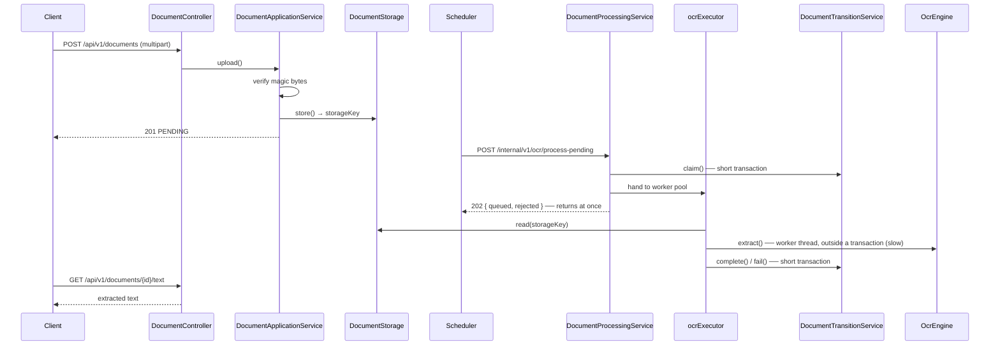

# OCR Automation Backend

**English** | [한국어](README.ko.md) | [简体中文](README.zh-CN.md) | [日本語](README.ja.md)

> A service that takes documents, extracts text with OCR and keeps the results.
> Built on **Spring Boot + Tesseract** with a ports-and-adapters structure.

OCR is slow, it fails often, and the engine gets replaced. Taking those three as
given, the goal is to make sure **slow work never pins a request**, **a failure never
loses a document**, and **swapping the engine leaves the business logic untouched**.

"When to process" is the [scheduler](https://github.com/hyunolike/ai.ocr-automation.system-backend.scheduler)'s
call; this service knows **only "how"**.

<br>

## 🎯 Design Goals

- **Make the OCR engine swappable** — business logic knows only the `OcrEngine` port; Tesseract is just one adapter
- **Make storage swappable** — the `DocumentStorage` port keeps a local FS → S3 move away from the domain
- **Keep slow work off both the DB connection and the HTTP thread** — separate acceptance from processing
- **Let the domain enforce state transitions** — no setters, only meaningful methods
- **Never leak someone else's documents** — every public query carries an owner condition

<br>

## 🚀 Functional Requirements

### Uploading a document

- Accept an image (PNG/JPEG/TIFF) or a PDF, store it and queue it for OCR.
- Decide the file type from **its content (magic bytes), not the header.**
  Extensions and `Content-Type` can be anything the caller likes.
- If the same owner re-uploads identical content (matching checksum), return the
  existing document instead of storing it again.
  - Unless that document is `FAILED` — then reset the retry count and queue it again.
- Never put the original filename into the storage key. Path traversal and filename
  collisions simply never arise.

### OCR processing

- **Accept** pending documents in batches and process them in a worker pool.
- Acceptance returns immediately without waiting for processing. (`202 Accepted`)
- When the worker queue is full, stop claiming and report the rejected count.
  The remaining documents get picked up on the next tick.
- On failure, return the document to `PENDING` if retries remain, otherwise mark it `FAILED`.
- Documents stuck in `PROCESSING` because an instance died are recovered after a while.

### Querying

- Fetch a document's status and a summary of its extraction result.
- The full extracted text comes from a **separate endpoint** — it can get long,
  so it isn't carried in the detail response.
- Lists can be filtered by status and are sorted newest first.

### Authentication and ownership

- Public APIs require an **API key**. The key determines the owner.
- Nowhere in a request is there a place to name an owner.
- Internal APIs (`/internal`) require a **shared token**. They are the scheduler's.
- Any path not covered by a rule is denied.

### Error handling

- Reject these uploads:
  - Empty files, or files over the size limit
  - Types outside the allow-list
  - **Content that doesn't match the declared type**
  - PDFs that are encrypted or exceed the page limit
- Answer **404, not 403**, when someone names a document that isn't theirs.
- Collapse unexpected exceptions into `INTERNAL_ERROR`, leaving the cause in the server log only.

<br>

## 📄 Interface Specification

### Public API

Every public API requires an API key.

```
X-API-Key: ocrk_...
Authorization: Bearer ocrk_...   # both accepted
```

| Method | Path | Description |
|---|---|---|
| `POST` | `/api/v1/documents` | Upload (multipart, field `file`) → `201` |
| `GET` | `/api/v1/documents/{id}` | Status and result summary |
| `GET` | `/api/v1/documents?status=&page=&size=` | List (status filter, newest first) |
| `GET` | `/api/v1/documents/{id}/text` | Full extracted text (`text/plain`) |

### Internal API

Scheduler only. Requires the shared token.

```
X-Internal-Token: <token>
```

| Method | Path | Description |
|---|---|---|
| `POST` | `/internal/v1/ocr/process-pending?batchSize=20` | **Accept** pending documents into the worker pool → `202` |
| `POST` | `/internal/v1/ocr/documents/{id}/process` | Process one **synchronously** (manual retry) |
| `POST` | `/internal/v1/ocr/recover-stalled` | Recover documents stuck in `PROCESSING` |
| `POST` | `/internal/v1/api-keys` | Issue an API key (plaintext appears only in this response) |
| `GET` | `/internal/v1/api-keys?ownerId=` | List keys (no plaintext, no hash) |
| `DELETE` | `/internal/v1/api-keys/{prefix}` | Revoke a key |

> ⚠️ The token is a **second line of defence.** The first is the network —
> `/internal` should be unreachable from outside via firewall or ingress rules.

### Document status

```
PENDING ──startProcessing──▶ PROCESSING ──completeWith──▶ COMPLETED
   ▲                              │
   │                              └──fail──▶ FAILED (retries exhausted)
   └──────────────────────────────┘
        goes back to PENDING while retries remain
```

| Status | Meaning |
|---|---|
| `PENDING` | Uploaded, waiting for OCR |
| `PROCESSING` | OCR in progress |
| `COMPLETED` | OCR succeeded |
| `FAILED` | Retries exhausted |

### Error codes

```json
{ "code": "CONTENT_MISMATCH", "message": "...", "timestamp": "2026-09-11T10:23:29Z" }
```

| code | HTTP | Situation |
|---|---|---|
| `UNAUTHORIZED` | 401 | API key missing, wrong or revoked (internal: token missing or wrong) |
| `FORBIDDEN` | 403 | Authenticated, but not for that path |
| `CONTENT_MISMATCH` | 400 | Content doesn't match the declared type; corrupt or encrypted PDF; too many pages |
| `INVALID_DOCUMENT` | 400 | Empty file, type outside the allow-list, no result yet, not awaiting processing |
| `DOCUMENT_NOT_FOUND` | 404 | No such document — **or it belongs to someone else** |
| `FILE_TOO_LARGE` | 413 | Over the upload size limit |
| `STORAGE_ERROR` | 500 | Storage I/O failure |
| `OCR_ENGINE_ERROR` | 503 | Engine unavailable |
| `INTERNAL_ERROR` | 500 | Anything else (cause stays in the server log) |

<br>

## 📐 Programming Requirements

- Use Java 21, Spring Boot 3.5.16 and Spring Cloud Config Client.
- PostgreSQL (production) / H2 (local and test); the schema has a **single source,
  Flyway.** JPA only `validate`s — it never creates the schema.
- **`OcrEngine` and `DocumentStorage` are ports.** Business logic knows only these
  interfaces; concrete implementations (Tesseract, local FS) are swappable adapters.
- **`DocumentApplicationService` must know nothing of HTTP or the OCR engine.**
  Swapping REST for another protocol should leave it reusable as is.
- **Do not put `@Transactional` on `DocumentProcessingService`.**
  State transitions belong to a separate bean so slow OCR never holds a DB connection.
  (Calling from within the same class skips the proxy, so the transaction wouldn't separate.)
- Domain objects expose no setters; state changes go through static factories and
  meaningful methods. Invalid transitions are blocked by the domain, not the service.
- **Controllers never take the owner as a parameter.** They ask `DocumentOwnerResolver`.
- **Commit granularity follows the feature checklist below.**

<br>

## ✅ Feature Checklist

- [x] Domain `Document` / `DocumentStatus` / `OcrResult`
  - [x] `Document.register()` static factory — no owner, no registration
  - [x] `startProcessing()` / `completeWith()` / `fail()` transitions
  - [x] `releaseClaim()` — hand back without incrementing retries when the queue refuses
  - [x] `resetForRetry()` — reset retries when a failed document is re-uploaded
  - [x] `isStalled()` / `recoverFromStall()` — stall detection and recovery
  - [x] `@Version` optimistic lock — no double claiming across instances
- [x] `DocumentRepository`
  - [x] Owner-scoped and system-scoped queries separated by name and comment
- [x] `DocumentApplicationService` — registration and lookup
  - [x] Size, type and content validation
  - [x] SHA-256 checksum de-duplication (owner-scoped)
  - [x] Re-processing on re-upload of a failed document
- [x] OCR processing pipeline
  - [x] `DocumentProcessingService` — claim → hand to worker pool (no transaction)
  - [x] `DocumentTransitionService` — transitions only (`REQUIRES_NEW`)
  - [x] Bounded queue + `AbortPolicy` backpressure
  - [x] No exception ever leaves a document in `PROCESSING`
- [x] `OcrEngine` port
  - [x] `TesseractOcrEngine` adapter
  - [x] `StubOcrEngine` — for environments without the native library
  - [ ] Word-level confidence from Tesseract
  - [ ] Image preprocessing (binarisation, deskew)
  - [ ] Per-page PDF processing
- [x] `DocumentStorage` port
  - [x] `LocalFileSystemDocumentStorage` — date-based keys, path escape blocked
  - [ ] S3 adapter
- [x] Upload type verification
  - [x] Magic bytes (PNG / JPEG / TIFF / PDF)
  - [x] PDF encryption check and page limit
- [x] Authentication and authorisation
  - [x] API keys — SHA-256 hash stored, plaintext shown once at issue
  - [x] `/internal` shared token (constant-time comparison)
  - [x] Actuator on a separate port
  - [x] `denyAll()` for uncovered paths
  - [ ] HTTPS termination
  - [ ] Separate operator rights from the service-to-service token
  - [ ] Key expiry and rotation, rate limiting
- [x] Owner isolation
  - [x] Owner condition enforced on every public query
  - [x] 404 instead of 403 for someone else's document
  - [ ] Organisation (tenant) level
- [x] Schema (Flyway)
  - [x] `V1` documents / `V2` owner / `V3` api_keys
  - [ ] `NEEDS_REVIEW` status and a confidence-based quality gate
- [x] Tests
  - [x] Domain state transitions
  - [x] Storage adapter (including path escape)
  - [x] Acceptance rules (release claim on a full queue)
  - [x] Type verification (disguised files rejected)
  - [x] Authentication (all three lanes)
  - [x] Owner isolation
  - [x] Pipeline integration (upload → accept → async processing → query)

<br>

## 📤 Results

> Messages are in Korean because they come straight from the service code.

### Upload succeeds

**Request**

```bash
curl -H "X-API-Key: ocrk_nRXV7l5..." -F "file=@scan.png" \
     http://localhost:8080/api/v1/documents
```

**Response** `201 Created`

```json
{
  "id": "a1964f60-f20d-48b7-97e0-b68a45d91daa",
  "originalFilename": "scan.png",
  "contentType": "image/png",
  "sizeBytes": 24,
  "status": "PENDING",
  "retryCount": 0,
  "failureReason": null,
  "uploadedAt": "2026-09-11T10:23:29.681623Z",
  "finishedAt": null,
  "ocrResult": null
}
```

### Acceptance — it doesn't wait

```bash
curl -X POST -H "X-Internal-Token: ..." \
     "http://localhost:8080/internal/v1/ocr/process-pending?batchSize=25"
```

**Response** `202 Accepted` — 25 documents accepted in **0.15 s**

```json
{ "queued": 25, "rejected": 0, "skipped": 0 }
```

`queued` counts what went into the queue, not what succeeded. The real outcome shows
up in the document status.

### After processing

```json
{
  "id": "a1964f60-7d14-4968-aa31-04ff7f105678",
  "status": "COMPLETED",
  "retryCount": 0,
  "finishedAt": "2026-09-11T07:13:41.479691Z",
  "ocrResult": {
    "engine": "stub",
    "language": "stub",
    "confidence": null,
    "pageCount": 1,
    "textLength": 85,
    "durationMillis": 1,
    "processedAt": "2026-09-11T07:13:41.476733Z"
  }
}
```

### Authentication fails — no key

```json
{ "code": "UNAUTHORIZED", "message": "유효한 인증 정보가 필요합니다", "timestamp": "..." }
```

### A disguised upload

A shell script renamed to `.png` and sent as `Content-Type: image/png`.

```json
{ "code": "CONTENT_MISMATCH", "message": "파일 내용이 image/png 형식이 아닙니다", "timestamp": "..." }
```

A JPEG disguised as a PNG — **the real type is named.**

```json
{ "code": "CONTENT_MISMATCH", "message": "파일 내용이 image/png 형식이 아닙니다 (실제: image/jpeg)", "timestamp": "..." }
```

Starts with `%PDF-` but the content is broken.

```json
{ "code": "CONTENT_MISMATCH", "message": "PDF 를 읽을 수 없습니다: 손상되었거나 암호화된 파일입니다", "timestamp": "..." }
```

### Someone else's document — 404

```json
{ "code": "DOCUMENT_NOT_FOUND", "message": "문서를 찾을 수 없습니다: e04fb648-...", "timestamp": "..." }
```

Indistinguishable from querying a document that doesn't exist. A 403 would tell the
caller that the document *does* exist, which is itself a leak.

<br>

## 🏗 Architecture



```
com.ocr.automation.backend
├── document/
│   ├── domain/          Document (state machine), DocumentStatus, OcrResult
│   ├── repository/      split into owner-scoped and system-scoped
│   ├── service/
│   │   ├── DocumentApplicationService    # registration/lookup (knows no HTTP or OCR)
│   │   ├── DocumentProcessingService     # acceptance orchestrator (no transaction)
│   │   └── DocumentTransitionService     # transitions only (short transactions)
│   ├── validation/      magic bytes + PDF inspection
│   └── web/             Controller + DTO + ExceptionHandler (adapter)
├── ocr/
│   ├── OcrEngine.java                    # port
│   ├── tesseract/TesseractOcrEngine      # adapter
│   └── stub/StubOcrEngine                # for environments without the native library
├── storage/
│   ├── DocumentStorage.java              # port
│   └── local/LocalFileSystemDocumentStorage
├── owner/DocumentOwnerResolver.java      # port
├── security/
│   ├── SecurityConfig.java               # the three authorisation lanes
│   ├── ApiKeyAuthenticationFilter        # public API
│   ├── InternalTokenAuthenticationFilter # service-to-service
│   └── apikey/                           # ApiKey domain + issue/verify
└── config/
```

### Why three services

| Class | Transaction | Role |
|---|---|---|
| `DocumentApplicationService` | yes | Registration and lookup. Short and simple |
| `DocumentProcessingService` | **none** | Only orders claim → hand to worker pool |
| `DocumentTransitionService` | `REQUIRES_NEW` | Transitions only. Never holds a connection long |

OCR takes seconds to tens of seconds. Run inside one transaction, the connection pool
dries up fast. Keeping the transition methods in the same class would mean
**no proxy and therefore no separate transaction**, so they live in their own bean.

<br>

## 🛠 Tech Stack

| Area | Technology |
|---|---|
| Language | Java 21 |
| Framework | Spring Boot 3.5.16 |
| Authentication | Spring Security (API key / shared token) |
| Configuration | Spring Cloud Config Client (2025.0.3) |
| Persistence | Spring Data JPA, PostgreSQL (production) / H2 (local, test) |
| Migration | Flyway |
| OCR | Tesseract via tess4j 5.20.0 |
| PDF inspection | Apache PDFBox |
| Build | Gradle 8.14.3 |

<br>

## 🏃 Getting Started

**The config server has to be up first.** Port, database and storage settings come from
[ocr-config-server](https://github.com/hyunolike/ai.ocr-automation.system-config.server).

```bash
# 1. Config server (separate terminal, 8888)
cd ../ai.ocr-automation.system-config.server && ./gradlew bootRun

# 2. Backend (local profile = H2 + stub engine)
./gradlew bootRun
```

```bash
TOKEN=local-dev-only-token   # development default

# 3. Issue an API key
KEY=$(curl -sS -X POST http://localhost:8080/internal/v1/api-keys \
        -H "X-Internal-Token: $TOKEN" -H "Content-Type: application/json" \
        -d '{"ownerId":"demo","label":"local"}' | jq -r .key)

# 4. Upload
curl -H "X-API-Key: $KEY" -F "file=@scan.png" http://localhost:8080/api/v1/documents

# 5. Accept for processing (normally the scheduler's job)
curl -X POST -H "X-Internal-Token: $TOKEN" \
     http://localhost:8080/internal/v1/ocr/process-pending

# 6. Result
curl -H "X-API-Key: $KEY" http://localhost:8080/api/v1/documents/{id}/text
```

| Item | Address |
|---|---|
| API | `http://localhost:8080/api/v1/documents` |
| H2 console (local) | `http://localhost:8080/h2-console` (JDBC `jdbc:h2:mem:ocrdb`, user `sa`) |
| Health check | `http://localhost:9080/actuator/health` (management port) |

### Tests

```bash
./gradlew test
```

| Test | What it covers |
|---|---|
| `DocumentTest` | Transition rules (retries, stall detection, invalid transitions blocked) |
| `LocalFileSystemDocumentStorageTest` | Key generation, path traversal, filename collisions |
| `DocumentProcessingServiceTest` | Acceptance rules — release the claim on a full queue, don't count it as a retry |
| `ContentTypeVerificationTest` | Type verification — disguised files, corrupt and oversized PDFs |
| `AuthenticationTest` | Three lanes — missing/wrong/revoked key, crossed privileges, unmapped paths |
| `DocumentOwnerIsolationTest` | Owner isolation — other owners' documents, per-owner de-duplication |
| `DocumentPipelineIntegrationTest` | Upload → accept → async processing → query over HTTP |

> Tests **build the schema with Flyway and let JPA only `validate`.**
> An entity and a migration that drift apart break startup.

<br>

## 🤔 Design Decisions

| Topic | Choice | Why |
|---|---|---|
| Processing model | Acceptance + worker pool instead of synchronous processing | `batch size × per-document time` exceeds the caller's timeout. Processing keeps running after the request is cut and overlaps the next tick |
| Backpressure | Bounded queue + `AbortPolicy` | `CallerRunsPolicy` makes the HTTP thread run OCR, reviving the very timeout problem |
| Queue refusal | `releaseClaim()`, not `fail()` | A busy queue isn't the document's fault. Counting it as failure pushes healthy documents to `FAILED` |
| Lost work | In-memory queue + stall recovery | On a crash, queued work is gone — but those documents are `PROCESSING`, and the recovery job already collects them |
| Engine swap | Port + `@ConditionalOnProperty` | The stub engine lets the whole pipeline be tested without the native library |
| Storage return value | A **storage key**, not a path | Moving to S3 leaves the domain and services unchanged |
| Type verification | Magic bytes by hand, not Tika | Only four types are allowed; Tika brings dependencies and startup time for hundreds |
| PDF inspection timing | At upload | Let it through and it surfaces during OCR — after a worker and the retry budget have already been spent |
| API key hashing | SHA-256, not bcrypt | Slow hashes protect low-entropy passwords. A 256-bit random needs none, and per-request verification only gains latency |
| Token comparison | `MessageDigest.isEqual` | `String.equals` stops at the first mismatch, letting timing reveal one character at a time |
| Authorisation default | `anyRequest().denyAll()` | A missing rule closes the path rather than opening it. Better than failing open |
| Someone else's document | 404, not 403 | A 403 confirms the document exists |
| De-duplication | Owner-scoped, not global | Global scope hands back another owner's document id for the same file |
| Schema source | Flyway alone; JPA `validate` | Local runs H2 in PostgreSQL mode against the same migrations, so drift shows up before production |

<br>

## ⚠️ Known Simplifications

Deliberately left out at this scaffolding stage. Each has to be resolved before real use.

- **No HTTPS** — the API key and internal token travel in the clear. TLS termination is mandatory across untrusted networks.
- **Key issuance shares the service-to-service token** — the scheduler's token can also mint keys. Operator rights need to be separate.
- **`/internal` is exposed on the public port** — the token guards it, but the path is still reachable on 8080. Firewall and ingress rules are the first defence.
- **Keys never expire** — revocation is manual and there is no lifetime. A rotation policy is needed.
- **No rate limiting** — one key can call without bound.
- **The whole file is held in memory** — the 20 MB cap makes that survivable, but larger files need streaming.
- **Tesseract confidence isn't collected** — `confidence` is always `null`, so no quality gate is possible.
- **PDF pages aren't counted in the result** — verification counts them, but `pageCount` stays `null`.
- **Stall recovery is time-based only** — a legitimately slow document can be reclaimed. Heartbeat updates would make it precise.
- **Originals are never deleted** — files pile up after processing. A retention policy is needed.
- **A local filesystem doesn't scale out** — add instances and they can't read each other's files.

<br>

## 🗺 Roadmap

- [ ] HTTPS termination, operator rights separation, key expiry and rotation, rate limiting
- [ ] Container image (Tesseract only in this service's image) + CI
- [ ] Observability — pending count, processing time, queue saturation, recovery count
- [ ] Image preprocessing (resolution normalisation, binarisation, deskew)
- [ ] Word-level Tesseract confidence + a `NEEDS_REVIEW` status
- [ ] Per-page PDF processing (skip OCR when a text layer exists)
- [ ] S3 storage adapter (port unchanged)
- [ ] Retention policy and a cleanup job
- [ ] Structured field extraction from the recognised text
