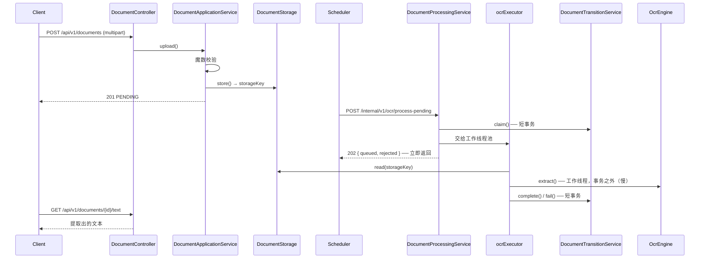

# OCR 自动化后端

[English](README.md) | [한국어](README.ko.md) | **简体中文** | [日本語](README.ja.md)

> 接收文档、用 OCR 提取文本并保存的服务。
> 基于 **Spring Boot + Tesseract**，采用端口/适配器结构。

OCR 慢、经常失败、引擎还会更换。以这三点为前提，目标是做到
**慢任务不占住请求**、**失败也不丢文档**、**换引擎时业务逻辑原封不动**。

"何时处理"由 [scheduler](https://github.com/hyunolike/ai.ocr-automation.system-backend.scheduler) 决定，
本服务**只知道"如何处理"**。

<br>

## 🎯 设计目标

- **让 OCR 引擎可替换**——业务逻辑只认识 `OcrEngine` 端口，Tesseract 只是其中一个适配器
- **让存储可替换**——用 `DocumentStorage` 端口隔开，本地 FS → S3 的迁移不会波及领域层
- **慢任务既不占数据库连接也不占 HTTP 线程**——把受理与处理分开
- **状态迁移规则由领域对象把关**——不开放 setter，只通过有意义的方法改状态
- **不泄露他人的文档**——公开 API 的所有查询都带上所有者条件

<br>

## 🚀 功能需求

### 文档上传

- 接收图片（PNG/JPEG/TIFF）或 PDF，保存并放入 OCR 队列。
- 文件格式**依据内容（魔数）判断，而不是请求头。**
  扩展名和 `Content-Type` 可以随意伪造。
- 同一所有者再次上传相同内容（校验和一致）时，不重复保存而返回已有文档。
  - 但若已有文档为 `FAILED`，则重置重试次数并重新入队。
- 不把原始文件名写进存储键。从根上杜绝路径穿越与文件名冲突。

### OCR 处理

- 按批次**受理**待处理文档，并在工作线程池中处理。
- 受理不等待处理结果，立即响应。(`202 Accepted`)
- 工作队列满时停止抢占并返回被拒数量。剩余文档会在下个周期重新被取走。
- 处理失败时，还有重试余量就退回 `PENDING`，超出上限则确定为 `FAILED`。
- 处理途中实例宕机而停留在 `PROCESSING` 的文档，经过一段时间后回收。

### 查询

- 查询文档状态与提取结果摘要。
- 提取出的全文通过**独立端点**获取。文本可能很长，不放进详情响应。
- 列表可按状态过滤，并按最新优先排序。

### 认证与所有者

- 公开 API 需要 **API 密钥**。密钥决定所有者。
- 请求中没有任何地方可以指定所有者。
- 内部 API (`/internal`) 需要**共享令牌**，仅供调度器使用。
- 规则未覆盖的路径一律拒绝。

### 异常处理

- 以下上传请求会被拒绝。
  - 空文件或超出大小上限
  - 不在允许列表中的格式
  - **文件内容与声明格式不符**
  - 加密的或超出页数上限的 PDF
- 指向他人文档时返回 **404 而非 403**。
- 预料之外的异常统一归为 `INTERNAL_ERROR`，原因只留在服务器日志中。

<br>

## 📄 接口规格

### 公开 API

所有公开 API 都需要 API 密钥。

```
X-API-Key: ocrk_...
Authorization: Bearer ocrk_...   # 两种都接受
```

| Method | Path | 说明 |
|---|---|---|
| `POST` | `/api/v1/documents` | 文档上传（multipart，字段名 `file`）→ `201` |
| `GET` | `/api/v1/documents/{id}` | 状态与结果摘要 |
| `GET` | `/api/v1/documents?status=&page=&size=` | 列表（状态过滤，最新优先） |
| `GET` | `/api/v1/documents/{id}/text` | 提取出的全文（`text/plain`） |

### 内部 API

仅供调度器使用，需要共享令牌。

```
X-Internal-Token: <令牌>
```

| Method | Path | 说明 |
|---|---|---|
| `POST` | `/internal/v1/ocr/process-pending?batchSize=20` | 把待处理文档**受理**进工作线程池 → `202` |
| `POST` | `/internal/v1/ocr/documents/{id}/process` | **同步**处理单件（手动重处理） |
| `POST` | `/internal/v1/ocr/recover-stalled` | 回收停滞在 `PROCESSING` 的文档 |
| `POST` | `/internal/v1/api-keys` | 签发 API 密钥（明文只在该响应中出现） |
| `GET` | `/internal/v1/api-keys?ownerId=` | 密钥列表（不含明文与哈希） |
| `DELETE` | `/internal/v1/api-keys/{prefix}` | 吊销密钥 |

> ⚠️ 令牌是**二次防御**。一次防御是网络——`/internal` 应通过防火墙或 ingress
> 规则阻断外部访问。

### 文档状态

```
PENDING ──startProcessing──▶ PROCESSING ──completeWith──▶ COMPLETED
   ▲                              │
   │                              └──fail──▶ FAILED（重试次数耗尽）
   └──────────────────────────────┘
        还有重试余量时退回 PENDING
```

| 状态 | 含义 |
|---|---|
| `PENDING` | 上传完成，等待 OCR |
| `PROCESSING` | OCR 处理中 |
| `COMPLETED` | OCR 成功 |
| `FAILED` | 重试次数耗尽 |

### 错误码

```json
{ "code": "CONTENT_MISMATCH", "message": "...", "timestamp": "2026-09-11T10:23:29Z" }
```

| code | HTTP | 场景 |
|---|---|---|
| `UNAUTHORIZED` | 401 | API 密钥缺失·错误·已吊销（内部 API 为令牌缺失·错误） |
| `FORBIDDEN` | 403 | 已认证但无该路径的权限 |
| `CONTENT_MISMATCH` | 400 | 内容与声明格式不符、损坏或加密的 PDF、页数超限 |
| `INVALID_DOCUMENT` | 400 | 空文件、允许列表外的格式、尚无结果、不处于待处理状态 |
| `DOCUMENT_NOT_FOUND` | 404 | 文档不存在，**或属于他人** |
| `FILE_TOO_LARGE` | 413 | 超出上传大小上限 |
| `STORAGE_ERROR` | 500 | 存储读写失败 |
| `OCR_ENGINE_ERROR` | 503 | 引擎不可用 |
| `INTERNAL_ERROR` | 500 | 其他异常（原因仅留在服务器日志） |

<br>

## 📐 编程要求

- 使用 Java 21、Spring Boot 3.5.16、Spring Cloud Config Client。
- 数据库用 PostgreSQL（生产）/ H2（本地·测试），表结构以 **Flyway 为唯一来源**管理。
  JPA 只做 `validate`，不创建表结构。
- **`OcrEngine` 与 `DocumentStorage` 是端口。** 业务逻辑只认识这些接口，
  具体实现（Tesseract、本地 FS）作为适配器替换。
- **`DocumentApplicationService` 不应了解 HTTP 或 OCR 引擎。**
  把 REST 换成其他协议时，它应能原样复用。
- **不要在 `DocumentProcessingService` 上加 `@Transactional`。**
  为了不让慢速 OCR 占住数据库连接，状态迁移交给独立的 Bean。
  （在同一个类内调用不会走代理，事务不会分离。）
- 领域对象不开放 setter，通过静态工厂与有意义的方法改变状态。
  错误的状态迁移由领域对象而非服务层拦截。
- **控制器不以参数接收所有者。** 而是询问 `DocumentOwnerResolver`。
- **提交粒度以下面的功能清单为单位。**

<br>

## ✅ 功能清单

- [x] 领域对象 `Document` / `DocumentStatus` / `OcrResult`
  - [x] `Document.register()` 静态工厂——没有所有者就无法登记
  - [x] `startProcessing()` / `completeWith()` / `fail()` 状态迁移
  - [x] `releaseClaim()`——队列拒收时归还而不增加重试次数
  - [x] `resetForRetry()`——失败文档重新上传时重置重试次数
  - [x] `isStalled()` / `recoverFromStall()`——停滞判定与回收
  - [x] `@Version` 乐观锁——防止多实例重复抢占
- [x] `DocumentRepository`
  - [x] 通过命名与注释区分所有者范围 / 系统范围查询
- [x] `DocumentApplicationService`——登记与查询
  - [x] 大小·格式·内容校验
  - [x] 基于 SHA-256 校验和的去重（所有者范围）
  - [x] 失败文档重新上传时重新处理
- [x] OCR 处理流水线
  - [x] `DocumentProcessingService`——抢占 → 交给工作线程池（无事务）
  - [x] `DocumentTransitionService`——仅状态迁移（`REQUIRES_NEW`）
  - [x] 有界队列 + `AbortPolicy` 背压
  - [x] 无论发生何种异常都不让文档滞留在 `PROCESSING`
- [x] `OcrEngine` 端口
  - [x] `TesseractOcrEngine` 适配器
  - [x] `StubOcrEngine`——供没有原生库的环境使用
  - [ ] Tesseract 单词级置信度采集
  - [ ] 图像预处理（二值化·倾斜校正）
  - [ ] PDF 逐页处理
- [x] `DocumentStorage` 端口
  - [x] `LocalFileSystemDocumentStorage`——按日期生成键，阻断路径越界
  - [ ] S3 适配器
- [x] 上传格式校验
  - [x] 魔数（PNG / JPEG / TIFF / PDF）
  - [x] PDF 加密判定与页数上限
- [x] 认证与授权
  - [x] API 密钥——存 SHA-256 哈希，签发时明文只出现一次
  - [x] `/internal` 共享令牌（常数时间比较）
  - [x] actuator 独立端口
  - [x] 规则未覆盖的路径 `denyAll()`
  - [ ] HTTPS 终结
  - [ ] 把运维权限从服务间令牌中分离
  - [ ] 密钥有效期·轮换、请求限流
- [x] 所有者隔离
  - [x] 所有公开查询强制带所有者条件
  - [x] 他人文档返回 404 而非 403
  - [ ] 扩展到组织（tenant）级
- [x] 表结构 (Flyway)
  - [x] `V1` documents / `V2` owner / `V3` api_keys
  - [ ] `NEEDS_REVIEW` 状态与基于置信度的质量闸门
- [x] 测试
  - [x] 领域状态迁移
  - [x] 存储适配器（含路径越界阻断）
  - [x] 受理规则（队列饱和时释放抢占）
  - [x] 格式校验（伪装文件拦截）
  - [x] 认证（三条通道）
  - [x] 所有者隔离
  - [x] 流水线集成（上传 → 受理 → 异步处理 → 查询）

<br>

## 📤 运行结果

> 消息为韩文，因为直接来自服务代码。

### 上传成功

**请求**

```bash
curl -H "X-API-Key: ocrk_nRXV7l5..." -F "file=@scan.png" \
     http://localhost:8080/api/v1/documents
```

**响应** `201 Created`

```json
{
  "id": "a1964f60-f20d-48b7-97e0-b68a45d91daa",
  "originalFilename": "scan.png",
  "contentType": "image/png",
  "sizeBytes": 24,
  "status": "PENDING",
  "retryCount": 0,
  "failureReason": null,
  "uploadedAt": "2026-09-11T10:23:29.681623Z",
  "finishedAt": null,
  "ocrResult": null
}
```

### 受理——不等待

```bash
curl -X POST -H "X-Internal-Token: ..." \
     "http://localhost:8080/internal/v1/ocr/process-pending?batchSize=25"
```

**响应** `202 Accepted`——受理 25 件耗时 **0.15 秒**

```json
{ "queued": 25, "rejected": 0, "skipped": 0 }
```

`queued` 只是进入队列的数量，不是成功数量。实际结果要看文档状态。

### 处理完成后查询

```json
{
  "id": "a1964f60-7d14-4968-aa31-04ff7f105678",
  "status": "COMPLETED",
  "retryCount": 0,
  "finishedAt": "2026-09-11T07:13:41.479691Z",
  "ocrResult": {
    "engine": "stub",
    "language": "stub",
    "confidence": null,
    "pageCount": 1,
    "textLength": 85,
    "durationMillis": 1,
    "processedAt": "2026-09-11T07:13:41.476733Z"
  }
}
```

### 认证失败——没有密钥

```json
{ "code": "UNAUTHORIZED", "message": "유효한 인증 정보가 필요합니다", "timestamp": "..." }
```

### 伪装格式的上传

把 shell 脚本改名为 `.png` 并以 `Content-Type: image/png` 发送。

```json
{ "code": "CONTENT_MISMATCH", "message": "파일 내용이 image/png 형식이 아닙니다", "timestamp": "..." }
```

把 JPEG 伪装成 PNG——**连真实格式都告知。**

```json
{ "code": "CONTENT_MISMATCH", "message": "파일 내용이 image/png 형식이 아닙니다 (실제: image/jpeg)", "timestamp": "..." }
```

以 `%PDF-` 开头但内容已损坏。

```json
{ "code": "CONTENT_MISMATCH", "message": "PDF 를 읽을 수 없습니다: 손상되었거나 암호화된 파일입니다", "timestamp": "..." }
```

### 查询他人文档——404

```json
{ "code": "DOCUMENT_NOT_FOUND", "message": "문서를 찾을 수 없습니다: e04fb648-...", "timestamp": "..." }
```

与查询不存在的文档时响应无从区分。403 等于告知"该文档存在"，本身就是信息泄露。

<br>

## 🏗 架构



```
com.ocr.automation.backend
├── document/
│   ├── domain/          Document(状态机), DocumentStatus, OcrResult
│   ├── repository/      按所有者范围 / 系统范围拆分
│   ├── service/
│   │   ├── DocumentApplicationService    # 登记·查询（不了解 HTTP/OCR）
│   │   ├── DocumentProcessingService     # 受理编排器（无事务）
│   │   └── DocumentTransitionService     # 仅状态迁移（短事务）
│   ├── validation/      魔数 + PDF 检查
│   └── web/             Controller + DTO + ExceptionHandler（适配器）
├── ocr/
│   ├── OcrEngine.java                    # 端口
│   ├── tesseract/TesseractOcrEngine      # 适配器
│   └── stub/StubOcrEngine                # 供没有原生库的环境
├── storage/
│   ├── DocumentStorage.java              # 端口
│   └── local/LocalFileSystemDocumentStorage
├── owner/DocumentOwnerResolver.java      # 端口
├── security/
│   ├── SecurityConfig.java               # 三条授权通道
│   ├── ApiKeyAuthenticationFilter        # 公开 API
│   ├── InternalTokenAuthenticationFilter # 服务间
│   └── apikey/                           # ApiKey 领域 + 签发·校验
└── config/
```

### 为什么服务分成三个

| 类 | 事务 | 职责 |
|---|---|---|
| `DocumentApplicationService` | 有 | 登记·查询。短小简单 |
| `DocumentProcessingService` | **无** | 只安排抢占 → 交给工作线程池的顺序 |
| `DocumentTransitionService` | `REQUIRES_NEW` | 仅状态迁移，不长时间占用连接 |

OCR 耗时数秒到数十秒。放在一个事务里跑，连接池很快就会枯竭。
把迁移方法放在同一个类里会**因为不走代理而无法分离事务**，所以拆成独立 Bean。

<br>

## 🛠 技术栈

| 领域 | 技术 |
|---|---|
| 语言 | Java 21 |
| 框架 | Spring Boot 3.5.16 |
| 认证 | Spring Security（API 密钥 / 共享令牌） |
| 配置 | Spring Cloud Config Client (2025.0.3) |
| 持久化 | Spring Data JPA、PostgreSQL(生产) / H2(本地·测试) |
| 迁移 | Flyway |
| OCR | Tesseract via tess4j 5.20.0 |
| PDF 检查 | Apache PDFBox |
| 构建 | Gradle 8.14.3 |

<br>

## 🏃 运行方式

**配置服务器必须先启动。** 端口·数据库·存储配置从
[ocr-config-server](https://github.com/hyunolike/ai.ocr-automation.system-config.server) 下发。

```bash
# 1. 配置服务器（另开终端，8888）
cd ../ai.ocr-automation.system-config.server && ./gradlew bootRun

# 2. 后端（local profile = H2 + stub 引擎）
./gradlew bootRun
```

```bash
TOKEN=local-dev-only-token   # 开发默认值

# 3. 签发 API 密钥
KEY=$(curl -sS -X POST http://localhost:8080/internal/v1/api-keys \
        -H "X-Internal-Token: $TOKEN" -H "Content-Type: application/json" \
        -d '{"ownerId":"demo","label":"本地"}' | jq -r .key)

# 4. 上传
curl -H "X-API-Key: $KEY" -F "file=@scan.png" http://localhost:8080/api/v1/documents

# 5. 受理处理（平时由调度器调用）
curl -X POST -H "X-Internal-Token: $TOKEN" \
     http://localhost:8080/internal/v1/ocr/process-pending

# 6. 结果
curl -H "X-API-Key: $KEY" http://localhost:8080/api/v1/documents/{id}/text
```

| 项目 | 地址 |
|---|---|
| API | `http://localhost:8080/api/v1/documents` |
| H2 控制台 (local) | `http://localhost:8080/h2-console`（JDBC `jdbc:h2:mem:ocrdb`，user `sa`） |
| 健康检查 | `http://localhost:9080/actuator/health`（管理专用端口） |

### 测试

```bash
./gradlew test
```

| 测试 | 验证对象 |
|---|---|
| `DocumentTest` | 状态迁移规则（重试、停滞判定、阻断错误迁移） |
| `LocalFileSystemDocumentStorageTest` | 键生成、路径穿越阻断、文件名冲突 |
| `DocumentProcessingServiceTest` | 受理规则——队列饱和时释放抢占且不增加重试次数 |
| `ContentTypeVerificationTest` | 格式校验——伪装文件拦截、损坏·超长 PDF |
| `AuthenticationTest` | 三条通道认证——密钥缺失·错误·吊销、权限交叉、未映射路径 |
| `DocumentOwnerIsolationTest` | 所有者隔离——他人文档拦截、按所有者去重 |
| `DocumentPipelineIntegrationTest` | 上传 → 受理 → 异步处理 → 查询的 HTTP 往返 |

> 测试**用 Flyway 建表，JPA 只做 `validate`。**
> 实体与迁移脚本不一致时会在启动阶段失败。

<br>

## 🤔 设计考量

| 主题 | 选择 | 理由 |
|---|---|---|
| 处理方式 | 用受理 + 工作线程池取代同步处理 | `批次大小 × 单件耗时` 会超过调用方超时。请求断开后处理仍在跑，与下个周期重叠 |
| 背压 | 有界队列 + `AbortPolicy` | `CallerRunsPolicy` 会让 HTTP 线程代跑 OCR，把超时问题原样复活 |
| 队列拒收时 | 用 `releaseClaim()` 而非 `fail()` | 队列繁忙不是文档的错。算作失败会把正常文档推向 `FAILED` |
| 任务丢失 | 内存队列 + 停滞回收 | 宕机会丢掉排队任务，但那些文档处于 `PROCESSING`，回收作业已经会收走 |
| 引擎替换 | 端口 + `@ConditionalOnProperty` | 有 stub 引擎，没有原生库也能测试整条流水线 |
| 存储返回值 | 返回**存储键**而非路径 | 迁移到 S3 时领域与服务层无需改动 |
| 格式校验 | 自己实现魔数而非用 Tika | 允许格式只有四种，而 Tika 为数百种格式带来依赖与启动开销 |
| PDF 检查时机 | 上传时 | 放过去的话要到 OCR 阶段才暴露，那时已经浪费了工作线程和重试额度 |
| API 密钥哈希 | 用 SHA-256 而非 bcrypt | 慢哈希是为低熵密码设计的。256 位随机数不需要，且每次请求都跑只会增加延迟 |
| 令牌比较 | `MessageDigest.isEqual` | `String.equals` 在首个不匹配处停止，可通过响应时间逐字符推测 |
| 授权默认值 | `anyRequest().denyAll()` | 漏写规则时是被拦住而不是被打开。比失败时敞开要好 |
| 他人文档 | 返回 404 而非 403 | 403 等于告知该文档存在 |
| 去重判定 | 所有者范围而非全局 | 全局的话会拿到别人上传相同文件的文档 ID |
| 表结构来源 | 只用 Flyway，JPA `validate` | 本地也用 PostgreSQL 模式的 H2 跑同一套迁移，不一致会在投产前暴露 |

<br>

## ⚠️ 已知简化

初期结构阶段有意保留的部分。实际投产前必须逐一解决。

- **没有 HTTPS**——API 密钥与内部令牌以明文传输。若经过不可信网段，TLS 终结是必需的。
- **密钥签发权限与服务间令牌相同**——用调度器的令牌也能签发密钥。运维权限需要单独设立。
- **`/internal` 暴露在公开端口上**——虽有令牌保护，但路径本身仍在 8080 上。防火墙·ingress 阻断才是一次防御。
- **密钥没有有效期**——吊销靠手动，也没有有效期。需要轮换策略。
- **没有请求限流**——一把密钥可以无限调用。
- **整个文件都加载到内存**——有 20MB 限制暂时撑得住，但要处理大文件需要改为流式。
- **不采集 Tesseract 置信度**——`confidence` 始终为 `null`，无法建立质量闸门。
- **结果中不统计 PDF 页数**——校验时会数，但结果的 `pageCount` 为 `null`。
- **停滞回收只看时间**——正常但耗时较长的文档也可能被回收。需要处理中的 heartbeat 更新才精确。
- **不删除原始文档**——处理完成后文件仍在堆积。需要保留期策略。
- **本地文件系统无法横向扩展**——增加实例后无法读取其他实例保存的文件。

<br>

## 🗺 后续计划

- [ ] HTTPS 终结、运维权限分离、密钥有效期·轮换、请求限流
- [ ] 容器镜像（tesseract 只放进本服务镜像）+ CI
- [ ] 可观测性——待处理文档数、处理耗时、队列饱和、回收件数
- [ ] 图像预处理（分辨率归一化·二值化·倾斜校正）
- [ ] Tesseract 单词级置信度采集 + `NEEDS_REVIEW` 状态
- [ ] PDF 逐页处理（已有文本层时跳过 OCR）
- [ ] S3 存储适配器（端口不变）
- [ ] 文档保留期策略与清理批处理
- [ ] 从提取文本中抽取结构化字段
